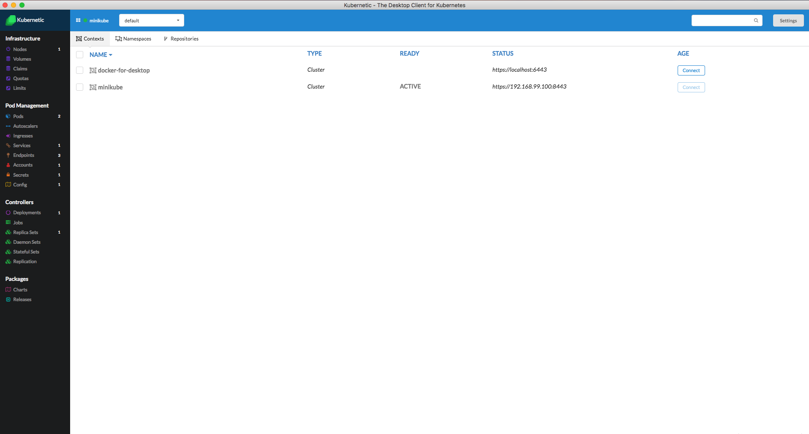

# Cluster Authentication

Kubernetic uses `~/.kube/config` file to find existing cluster contexts and handle authentication. This means that as soon as you have a _kubectl_ client configured to your machine _Kubernetic_ will be able to login to your configured clusters.

At the moment _Kubernetic_ only reads configuration so you first need to configure your authentication using _kubectl_ commands. Follow the guide [here](http://kubernetes.io/docs/user-guide/kubeconfig-file/) for more details on how to configure `~/.kube/config` file.

Once you manage to login to your cluster continue to the next section.


**Kubernetic and CLI tools share current context**

* Kubernetic monitors the `~/kube/config`for changes so if you switch between contexts on CLI either using `kubectl`or with `kubectx` it will refresh automatically with new context.
* If you change context in Kubernetic the change is reflected on Kube config and CLI tools.


