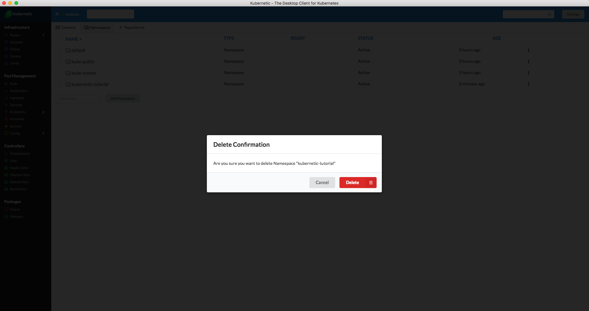

# Namespaces

Now that you have a working cluster connected to your _Kubernetic_ client you can continue with handling the namespaces.


[Namespaces](https://kubernetes.io/docs/concepts/overview/working-with-objects/namespaces/) is a way to virtually split an existing cluster to separate environments. Most objects inside Kubernetes act inside a specific namespace, which means when you switch namespace a fresh environment will be provided.


Go to the **Settings** &gt; **Namespaces** screen.


You will see there your existing namespaces. Kubernetes creates an active _"default"_ namespace automatically which is where your objects act on by default. It also creates a _"kube-system"_ namespace where all cluster's management objects are stored \(e.g. A DNS service\).

### Creating Namespace

Let's create a namespace:

* Fill name: **kubernetic-tutorial**
* Click **Add Namespace** button


To create a namespace using kubectl CLI:

```bash
kubectl create namespace kubernetic-tutorial
```


### Switching Namespace

The active namespace can be seen on the top menu bar, you can switch to the new namespace by selecting the name:



Namespace selection affects only Kubernetic. In order to see the selected namespace using kubectl you need to configure the command properly.

e.g. to see the pods of `kubernetic-tutorial` namespace:

```bash
kubectl get pods --namespace kubernetic-tutorial
```


### Deleting Namespace

Namespaces can be deleted from the menu.


A confirmation dialog is shown before deleting the namespace:




To delete a namespace using kubectl CLI:

```bash
kubectl delete namespace kubernetic-tutorial
```



Deletion of a namespace propagates the deletion of all resources under that namespace.



