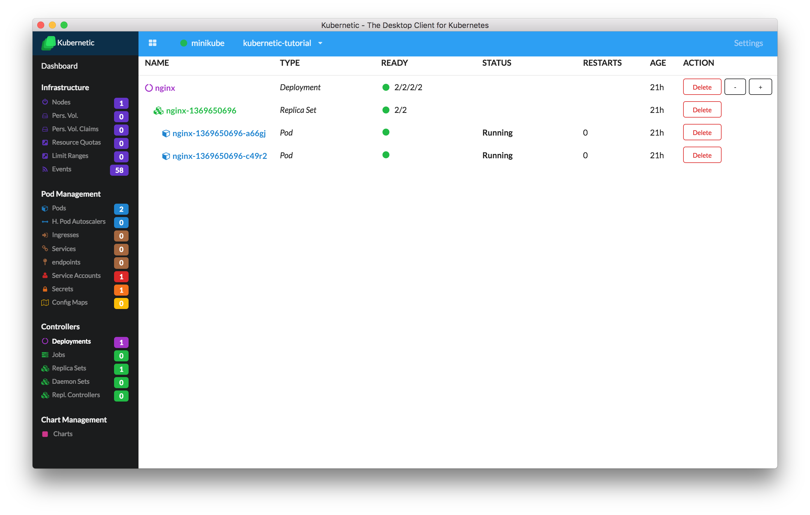

# Issues for Kubernetic

[Kubernetic](https://www.kubernetic.com): The Desktop Client for Kubernetes

To download the client go [here](https://www.kubernetic.com)

For more information and the tutorial go to the [documentation page](http://docs.kubernetic.com/)

# Reporting Issues

In this repository you can report any issues you encounter
