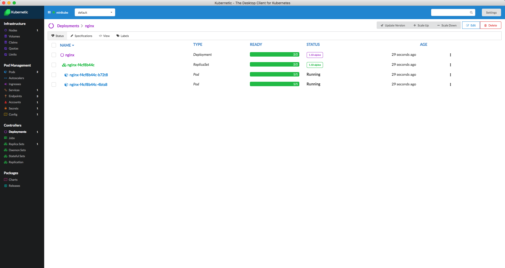

# Introduction

[Kubernetic](https://www.kubernetic.com): The Desktop Client for Kubernetes

It provides the following features:

* Real time visualization of the Cluster

Get a view of your cluster with real-time updates directly on your screen.

* Support for multiple clusters

Switch rapidly between multiple clusters, e.g. Your development and production environment.

* Support for helm chart stores

Fast and easy deployment of public or private chart recipes.

To download the client go [here](https://kubernetic.com)

For more information and the tutorial go to the [documentation page](http://docs.kubernetic.com/)

## Reporting Issues

To report issues you can go [here](https://github.com/harbur/kubernetic/issues)

