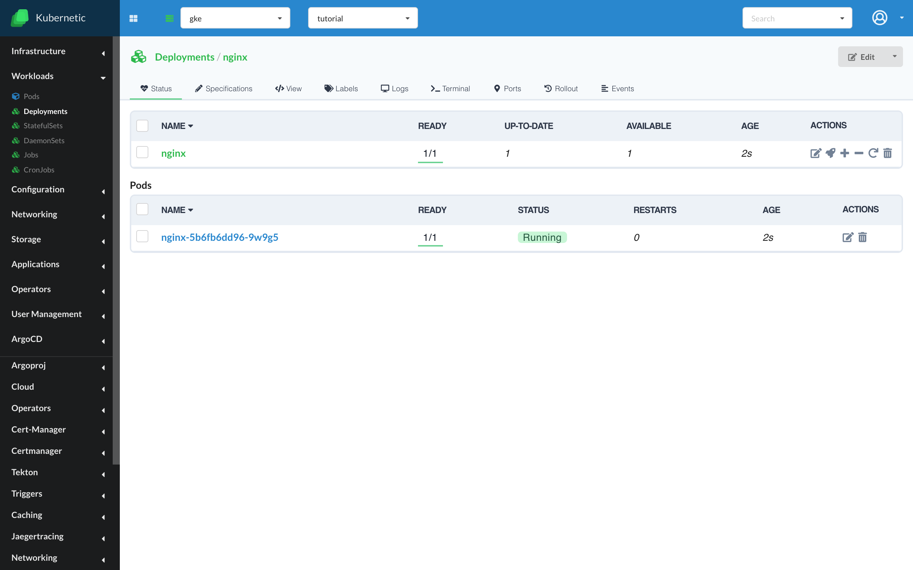

# Getting Started

[Kubernetic](https://www.kubernetic.com): Supercharge your Kubernetes clusters.

## Features

**Desktop edition**

* Supports desktop installation on Mac, Windows, Linux operating systems for a single user.
* Can manage any Kubernetes cluster.
* Support for multiple clusters.
* Visualization of Resources with real-time updates, for specific or all namespaces.
* Visualization of CustomResources and APIResources with real-time updates, for specific or all namespaces.
* [Helm] 3 support, with the ability to manage private & pubic repositories, charts and releases.
* Port forwarding of a workload (e.g. pod, deployment, daemonset) or service.
* Log streaming of a workload or service.
* Terminal shell of a workload or service.
* User management.
* CPU and Memory metrics visualization.
* _Coming soon:_ Debug shell of a workload or service (bring your own image with debug tooling).

**Enterprise edition (on private beta)**

* Deployment on-site, with multiple users.
* Single sign-on integration with authentication and authorization os user & groups.
* Support for Operators, with Operator Lifecycle Management integration.
* [ArgoCD] integration, with the ability to view and manage Applications.
* _Coming Soon:_ [TektonCD] integration, with the ability to view and manage Pipelines.

## Reporting Issues

To report issues you can go [here](https://github.com/harbur/kubernetic/issues)

[Helm]: https://helm.sh/
[ArgoCD]: https://argoproj.github.io/argo-cd/
[TektonCD]: https://tekton.dev/