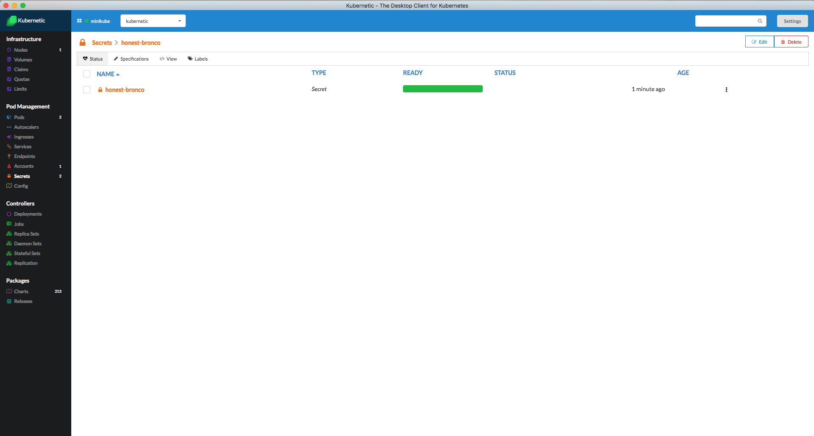
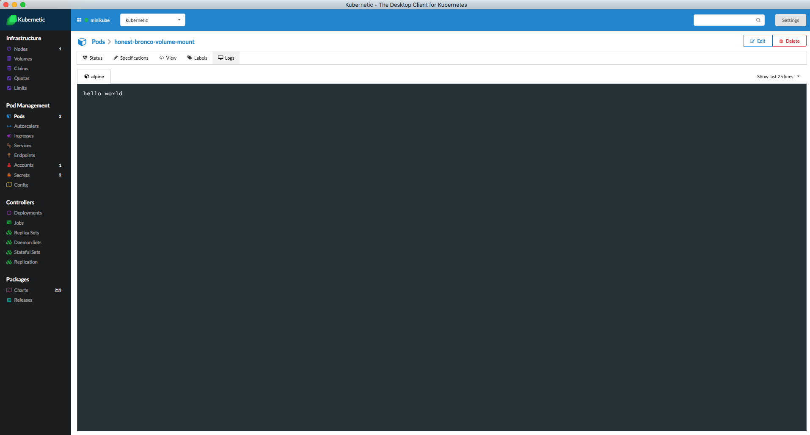

# Secrets

Objects of type secret are intended to hold sensitive information, such as passwords, OAuth tokens, and ssh keys

For more information about Secrets checkout the [Kubernetes User Guide](http://kubernetes.io/docs/user-guide/secrets/).

In this Tutorial we'll see how to build a dynamic Secret and read the secret as a variable from a Pod.

### Secret Sample

We don't want to store sensitive information under version control, and since Charts are stored under version control we want to avoid exposing them. So instead of creating a password and storing it inside the Chart, we'll generate it on-the-fly during deployment.

Deploy [**kubernetic/secret-sample**](https://github.com/harbur/kubernetic-charts/tree/master/charts/secret-sample) Chart.

Here is the Chart's definition:

```yaml
apiVersion: v1
kind: Secret
metadata:
  name: {{.Release.Name}}
type: Opaque
data:
  password: {{ b64enc (randAlphaNum 32) }}
  username: {{ b64enc "user1" }}
  secret-file: {{ .Values.SecretFileContent }}
---
apiVersion: v1
kind: Pod
metadata:
  name: {{.Release.Name}}-env
spec:
  terminationGracePeriodSeconds: 0
  restartPolicy: Never
  containers:
  - name: alpine
    image: alpine:3.5
    command: ["echo", "hello $(password)"]
    env:
    - name: password
      valueFrom:
        secretKeyRef:
          name: {{.Release.Name}}
          key: password
---
apiVersion: v1
kind: Pod
metadata:
  name: {{.Release.Name}}-volume-mount
spec:
  terminationGracePeriodSeconds: 0
  restartPolicy: Never
  containers:
  - name: alpine
    image: alpine:3.5
    command: ["cat", "/secret/secret-file"]
    volumeMounts:
    - mountPath: /secret
      name: secret
  volumes:
    - name: secret
      secret:
        secretName: {{ .Release.Name }}
```

Charts are written in [Helm](https://github.com/kubernetes/helm/) format, and they support various [template functions](https://github.com/kubernetes/helm/blob/master/docs/charts.md#templates-and-values). Here is a [list](https://github.com/Masterminds/sprig) of some functions.

* The `.Release.Name` is resolved during the deployment of the release. This enables to have multiple Chart releases on the same namespace.
* In our scenario we'll use `randAlphaNum 32` to generate a random alpha-numeric string of 32 characters.
* Secret values are stored in base64 inside Kubernetes, so we wrap the command with `b64enc` function.

Now go to the Secrets section. You'll see the generated Secret.



Go to the Pods section and click on the generated Pod you'll see the output of the Pod



## Cleanup

Go to the Releases section

* Delete the release of the Chart `secret-sample`
