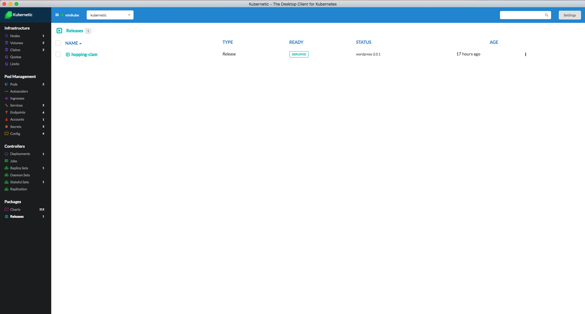
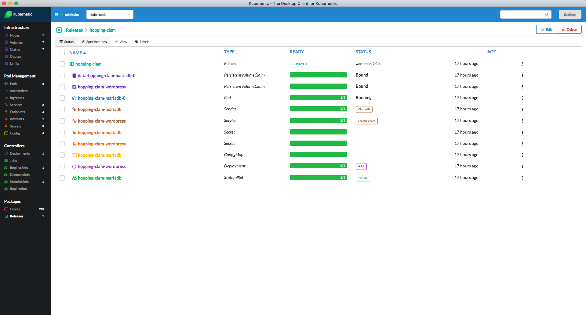

# Releases

In Releases section we manage the Helm Releases.

::: tip
When a chart is installed, a [Release](https://github.com/kubernetes/helm/blob/master/docs/glossary.md#release) is deployed. A single chart may be installed many times into the same cluster, and create many different releases. For example, one can install three PostgreSQL databases by running helm install three times with a different release name.
:::

### Listing Releases

**with Kubernetic**

Releases of helm are listed here:



**with helm**

To list the releases of the current namespace using helm CLI:

```bash
helm list --namespace NAMESPACE
```

### Details of a Release

**with Kubernetic**

Viewing the details of a release you can see the generated components of that Release and navigate to them.



**with helm**

To see the details of a release using helm CLI:

```bash
helm status RELEASE_NAME
```


