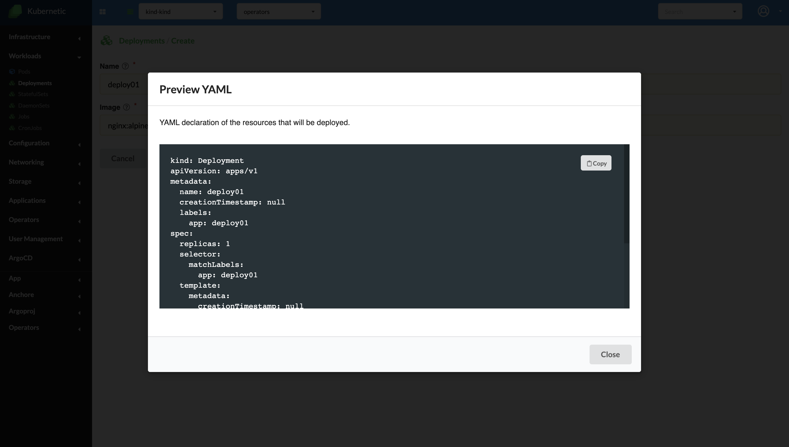
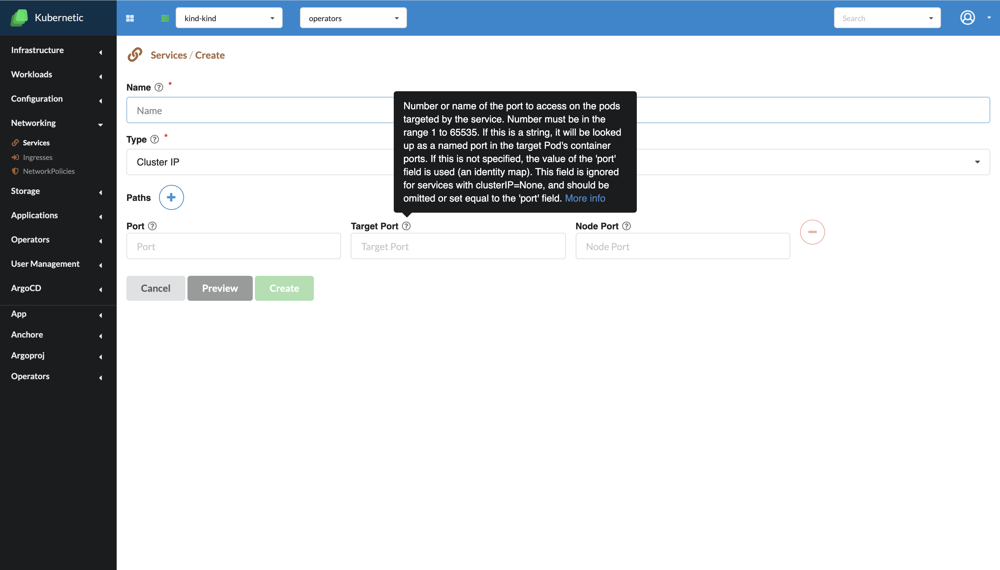

# Create

*Since version  v.2.10.0

**Preview**

Close to each "Create" button the "Preview" option is displayed. This option allows us to see the YAML file of an object, before creating it. In order for this option to be available all the mandatory fields from the Create screen should be filled.

**Description**

On the top of each field in any Create screen a question mark is available. By hovering it, a brief description of that field signification will be displayed.

