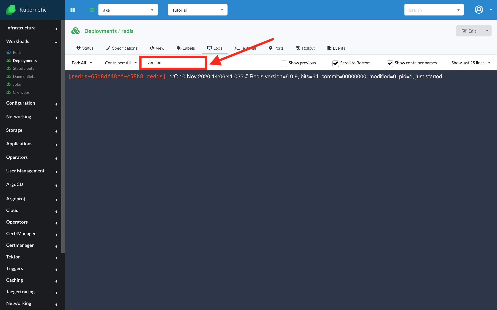

# Filter logs

*Since version  v.2.11.0

In the logs section of each workload, above the logs screen, you can see a "Search tab" where you can filter the logs by some keywords/phrases. This features works the same as the "grep" function.

