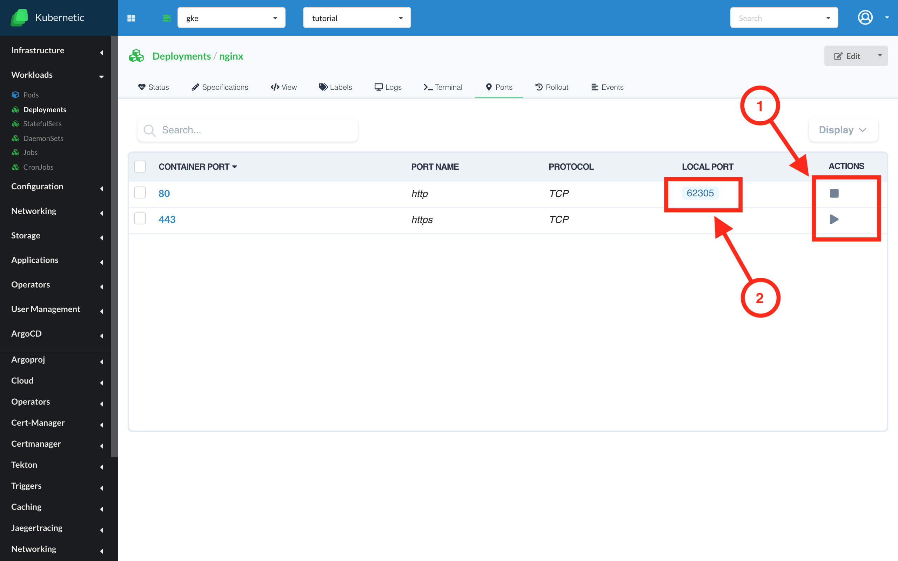

# Port-forwarding

Note: Port-forwading is supported only in the desktop version of the application.

**Starting a port-forward**

For each workload object (except CronJobs), and for services you are able to start a port forwarding. This option is available only for the objects that have at least one port within its definition.
In order to do so, you need to enter in the screen of an object, enter in the "Ports" tab and press the "Port-Forward" button. The port will be randomly chosen. 

**Listing all port-forwards**

In order to list all the port-forwards that are currently active, you need to go in the top right part of the screen, press on the user icon and select the "Port forwards" tab. There, all the active port-forwards will be displayed in a list. 

**Stopping port-forwards**

In order to stop a port-forward you need to press the "Stop" button, either from the port-forwards list, either from the page of the object itself.