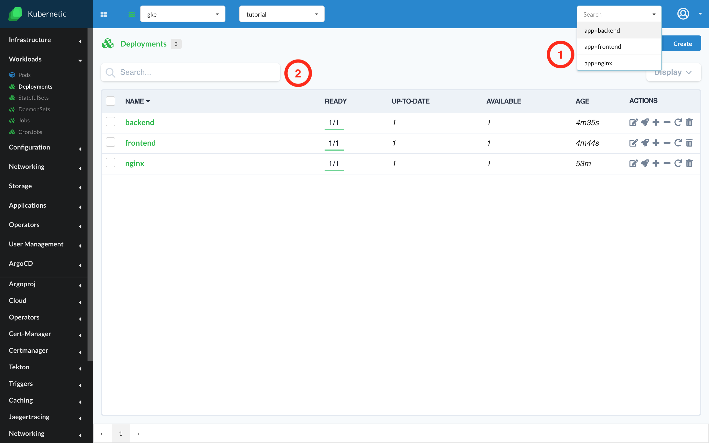

# Search tab

*Since version  v.2.11.0

In order to filter any list of objects that is available in the application you can make use of the search tab feature. This tab is present in the top right part of the application and filters the objects from the current screen, by their names or their labels. Multiple filters can be added, being combined under a logical "OR" relation.

