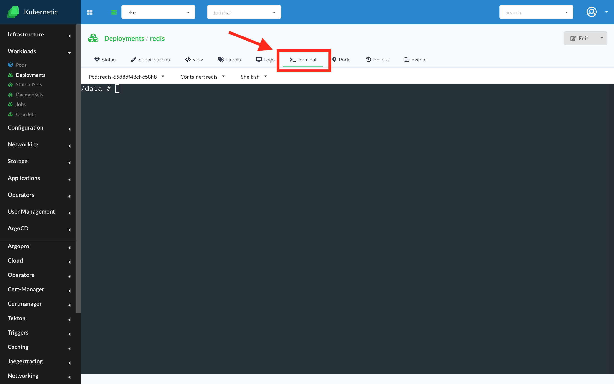

# Terminal

### Terminal support

In case you need to do different operations from within your pod, you can open an interactive terminal and run commands directly from the application. On the top of the terminal screen you can choose to which container to connect and the command type to start in the terminal (sh, bash, cmd, powershell).

