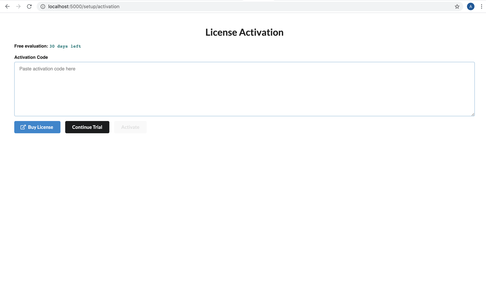
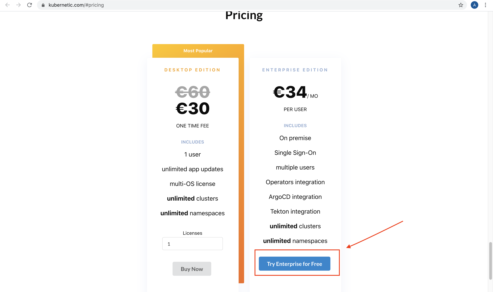
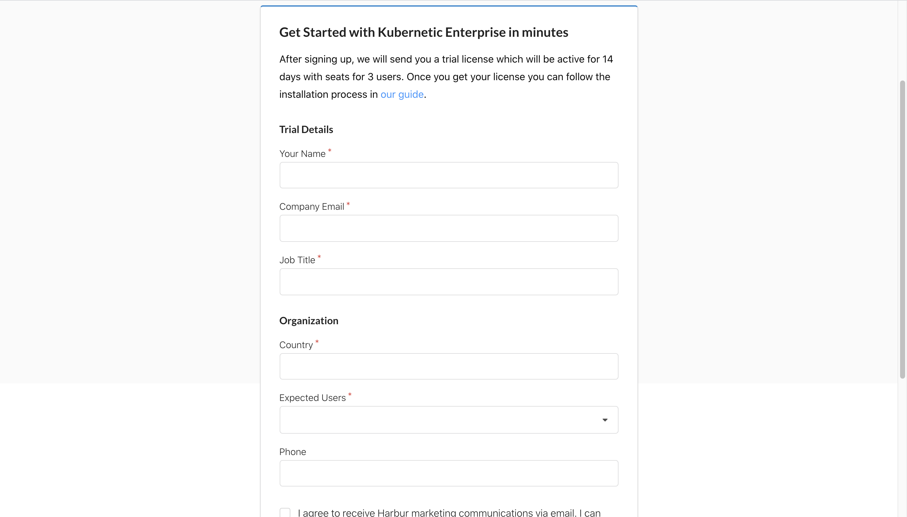

# Enterprise

To install Kubernetic Enterprise, you will need [Helm] and [Kubectl] CLI tools.

[Helm]: https://helm.sh/
[Kubectl]: https://kubernetes.io/docs/tasks/tools/install-kubectl/

* Add the following chart repository:

```sh
(⎈) ➜ helm repo add kubernetic https://harbur.github.io/kubernetic-charts
"kubernetic" has been added to your repositories
```

* Create a Namespace (recommended name `kubernetic`)

```sh
(⎈) ➜ kubectl create namespace kubernetic
namespace/kubernetic created
```

* Install Kubernetic:

```sh
(⎈) ➜ helm install kubernetic --namespace kubernetic kubernetic/kubernetic
NAME: kubernetic
LAST DEPLOYED: Wed Sep  2 14:23:06 2020
NAMESPACE: kubernetic
STATUS: deployed
REVISION: 1
```

* Wait for Pods to be running:

```sh
(⎈)➜ kubectl get pod --namespace kubernetic -w
NAME                                   READY   STATUS    RESTARTS   AGE
kubernetic-backend-66d49f8d96-7sv77    1/1     Running   0          66s
kubernetic-frontend-744d647796-8d86r   1/1     Running   0          66s
```

* Open connection to Kubernetic with port-forward:

```sh
(⎈)➜  ~ kubectl port-forward --namespace kubernetic svc/kubernetic-frontend 5000:80
Forwarding from 127.0.0.1:5000 -> 80
Forwarding from [::1]:5000 -> 80
```

* Open on browser the UI http://localhost:5000

Continue the setup process on screen.



From this point, if you already have an active license you can insert it and press the "Activate" button. 

In case you do not own an active license press the "Buy license" button and you will be redirected to the [Kubernetic official website](https://www.kubernetic.com/#pricing). Here, press the button "Try Enterprise for Free"




After this you will be redirected to another page where you should complete a form. 



After completing the form, you should recieve an e-mail with a trial license that will be available for 14 days. Note that the e-mail may not arrive immediately. 


