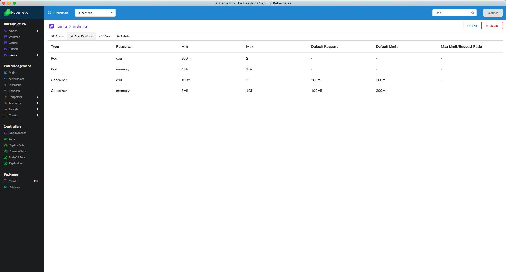

# Limits

::: tip
[Limit Ranges](https://kubernetes.io/docs/tasks/administer-cluster/manage-resources/memory-default-namespace/) helps define boundaries on the memory and cpu that Pods can claim on each namespace. This helps cluster operators manage the resources efficiently.
:::

## Tutorial

In this tutorial we'll configure Limit Ranges to the `kubernetic-tutorial` namespace.

### Limit Range Sample

Deploy [**kubernetic/limitrange-sample**](https://github.com/harbur/kubernetic-charts/tree/master/charts/limitrange-sample) Chart.

Here is the Limit Range definition:

```yaml
apiVersion: v1
kind: LimitRange
metadata:
  name: mylimits
spec:
  limits:
  - max:
      cpu: "2"
      memory: 1Gi
    min:
      cpu: 200m
      memory: 6Mi
    type: Pod
  - default:
      cpu: 300m
      memory: 200Mi
    defaultRequest:
      cpu: 200m
      memory: 100Mi
    max:
      cpu: "2"
      memory: 1Gi
    min:
      cpu: 100m
      memory: 3Mi
    type: Container
```

Now go to the Limit Ranges section. You'll see the `mylimits` Limit Range that configures the limits of cpu and memory. If you check the Specifications you can see details about the limits of memory and cpu.



## Cleanup

You can now delete the release of the `limitrange-sample` chart.

