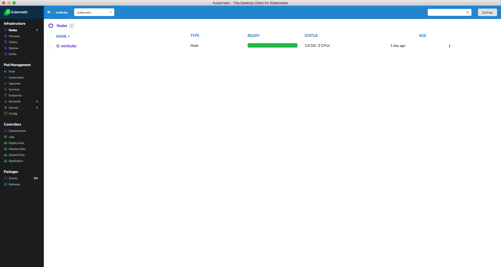
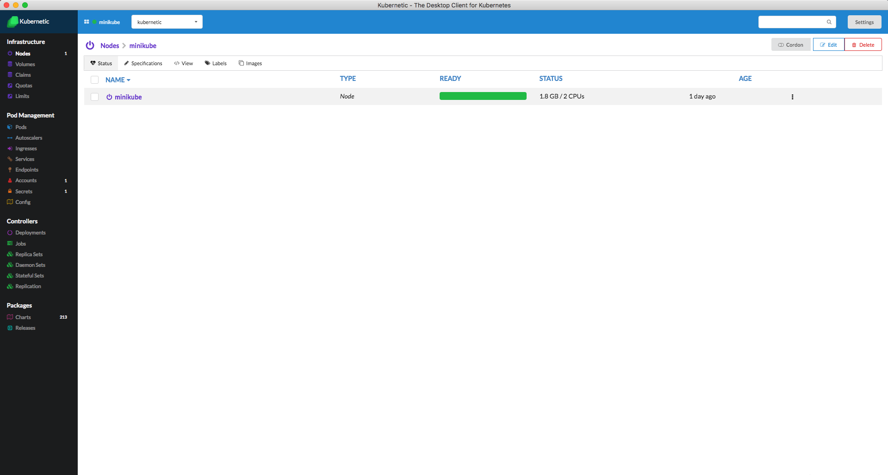
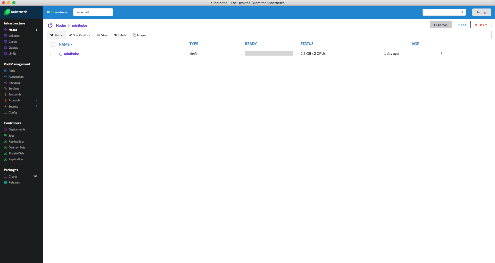

# Nodes

::: tip
A [Node](https://kubernetes.io/docs/concepts/architecture/nodes/) is a worker machine in Kubernetes. A node may be a VM or physical machine, depending on the cluster. Each node has the services necessary to run Pods and is managed by the master components.
:::

### Listing Nodes

The nodes of the cluster are listed on the nodes section:

### Details of a Node

Clicking on a Node a detailed view of the Node appears:

### Cordoning a Node

A Node can be \(un\)cordoned using the Cordon button. Once the node is cordoned the Ready state of the Node is set to false.

::: danger
Make sure to **uncordon** the Node before continuing. A Cordoned node doesn't accept new Pod requests.
:::

