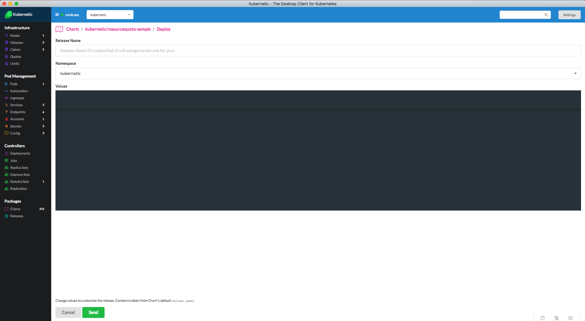
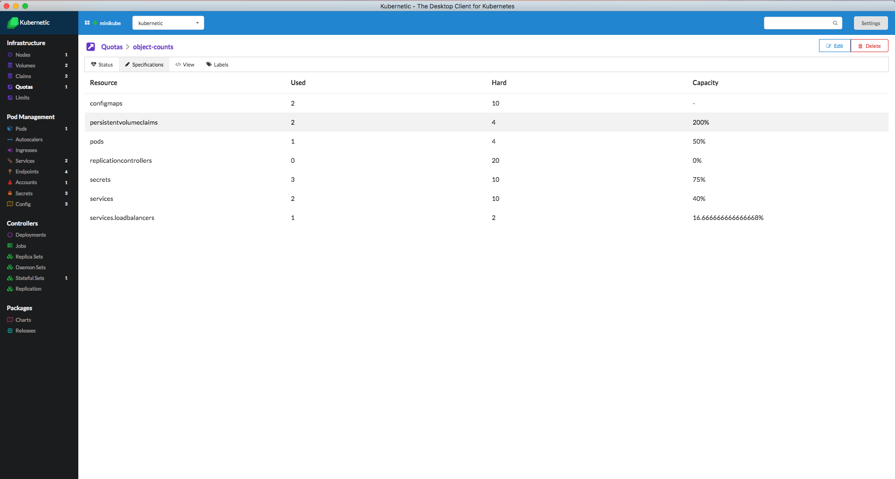
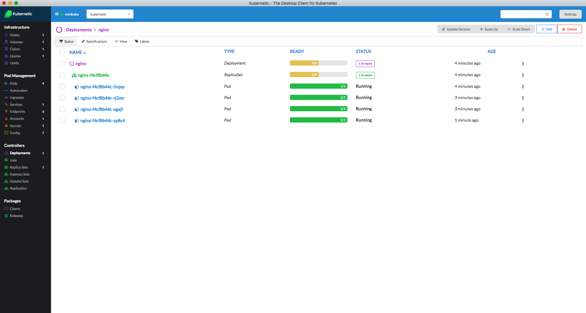

---
tags:
 - resourcequotas
---

# Quotas

When several users or teams share a cluster with a fixed number of nodes, there is a concern that one team could use more than its fair share of resources.

Resource quotas are a tool for administrators to address this concern.

::: tip
A [Resource Quota](https://kubernetes.io/docs/concepts/policy/resource-quotas/), provides constraints that limit aggregate resource consumption per namespace. It can limit the quantity of objects that can be created in a namespace by type, as well as the total amount of compute resources that may be consumed by resources in that project.
:::

## Quotas Tutorial

In this tutorial we'll activate Resource Quota to the `kubernetic-tutorial` namespace.

### Quotas Sample

Deploy [**kubernetic/resourcequota-sample**](https://github.com/harbur/kubernetic-charts/tree/master/charts/persistentvolume-sample) Chart.



Here is the Resource Quota definition:

```yaml
apiVersion: v1
kind: ResourceQuota
metadata:
  name: object-counts
spec:
  hard:
    pods: "4"
    configmaps: "10"
    persistentvolumeclaims: "4"
    replicationcontrollers: "20"
    secrets: "10"
    services: "10"
    services.loadbalancers: "2"
```

Now go to the **Quotas** section. You'll see the `object-counts` Resource Quota that defines the hard limit of objects that can exist inside the current namespace.




Let's test that. Deploy the [**kubernetic/nginx**](https://github.com/harbur/kubernetic-charts/tree/master/charts/nginx) Chart and increase the Pod replicas to 8. You'll find that Kubernetes only permits 4 Pods to be Running.



### Cleanup

You can now delete the `nginx` and `resourcequotas-sample` Releases

