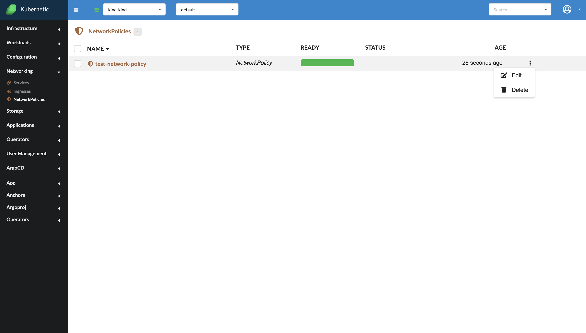

# Network policies

*Since version  v.2.11.0

If you want to control traffic flow at the IP address or port level, then you might consider using NetworkPolicies. NetworkPolicies are an application-centric Kubernetes objects which allow you to specify how a pod is allowed to communicate with various network "entities" over the network. For more details you can check [Kubernetes official documentation](https://kubernetes.io/docs/concepts/services-networking/network-policies/)

For the moment, Kubernetic can display, edit and delete the network policies from a Kubernetes cluster. Creation feature is still unavailable.

