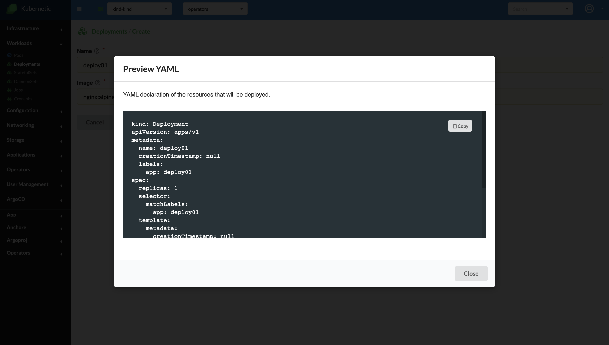
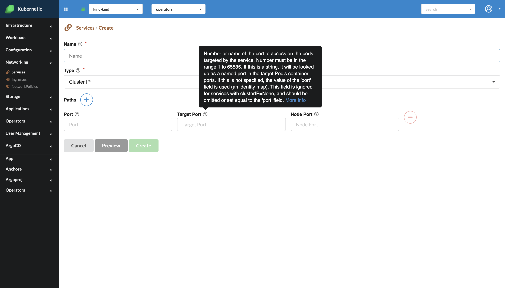

# Create

**Preview**

Near every "Create" button we will have the "Preview" option. This option will allow us to see the YAML file of an object, before creating it. In order for this option to be available all the mandatory fields from the Create screen should be filled.

**Description**

On the top of each field in any Create screen we will have a question mark available. By hovering it, a brief description of that field signification will be displated.

