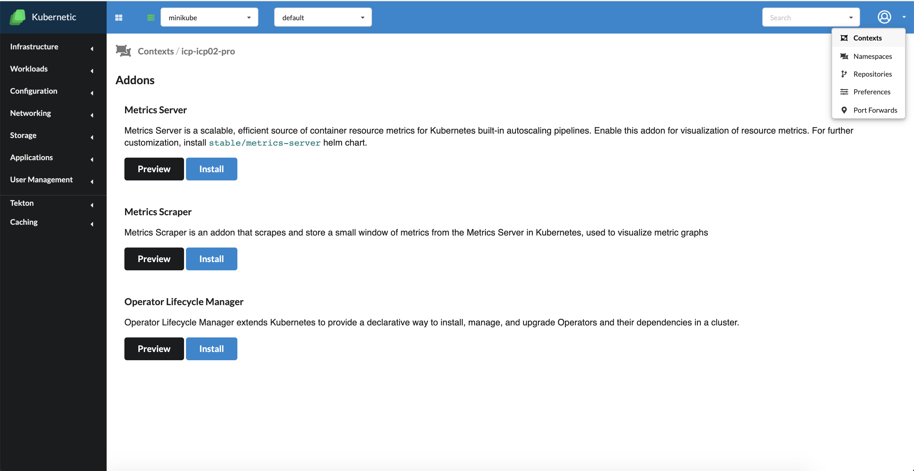
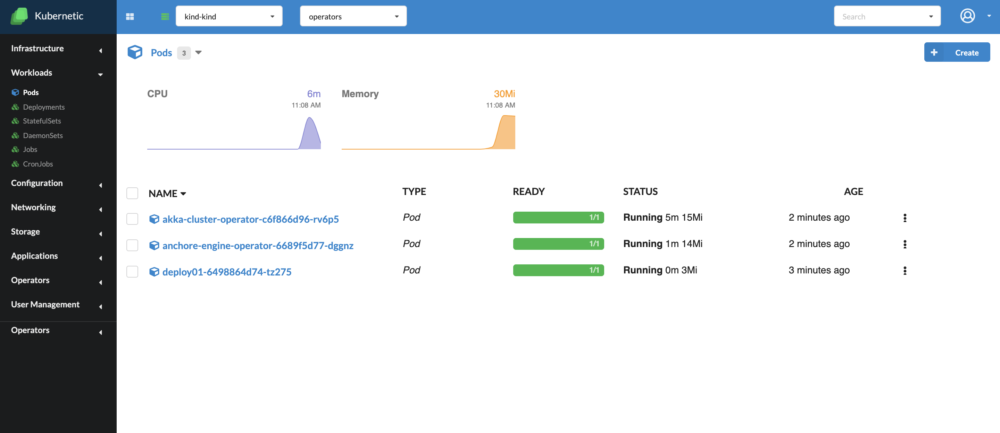
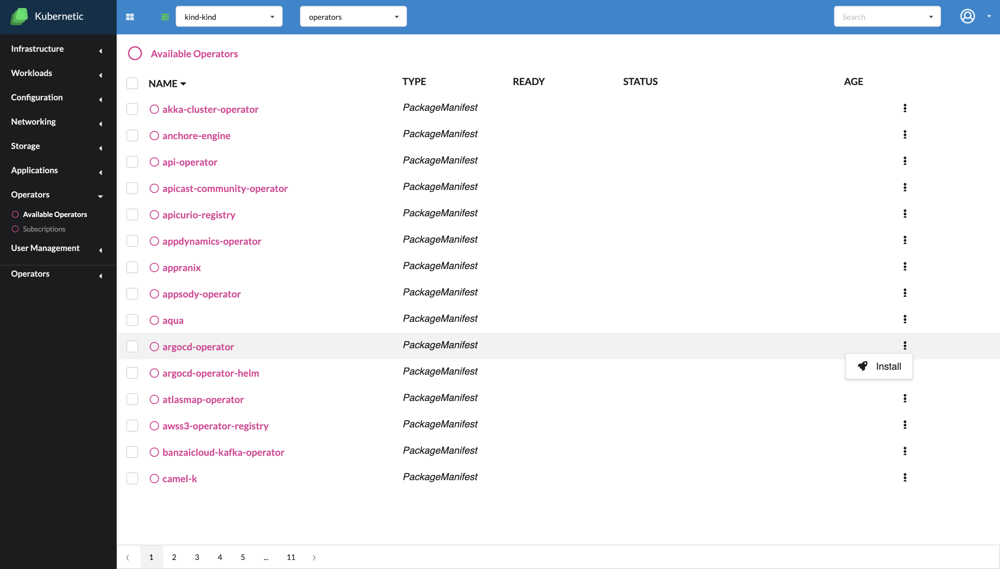

# Addons

*Since version  v.2.10.0

In the contexts tab, if you click on one of them, a page of addons are available for installation:
* Metrics Server
* Metrics Scraper
* Operator Lifecycle Manager

**Metrics Server** is a scalable, efficient source of container resource metrics for Kubernetes built-in autoscaling pipelines. Enable this addon for visualization of resource metrics. For further customization you can install stable/metrics-server helm chart.

**Metrics Scraper**  is an addon that scrapes and store a small window of metrics from the Metrics Server in Kubernetes, used to visualize metric graphs

**Operator Lifecycle Manager** extends Kubernetes to provide a declarative way to install, manage, and upgrade Operators and their dependencies in a cluster.

You can install any of these addons by clicking the button "Install". You can check the YAML file of the installation by clicking the button "Preview". 

### Installing the metrics solution

In order to have a complete solution for metrics available for all the workloads (pods, deployments, statefulsets, daemonsets and jobs) you will need to install both Metrics Server, and Metrics Scraper. 

After the installation, go to the workloads screen and choose any category. You should be able to see in the top of the screen a graph, displaying the consumption of all objects in the last 15 minutes, of the selected type. Also, in the Status part, the instantenous consumption for each object will be provided. Users can also select a subset of resources, by marking the checkboxes from the left part of the page, in order to see the consumption for that specific list of items.

### Installing the Operator Lifecycle Manager (OLM)

Following the installation of the OLM addon, the Operators category in the side bar of the application will appear. In this screen, a list of available operators will be shown. 

### Uninstalling addons

Uninstalling addons is as simple as going back to the contexts page, clicking on a context, and then pressing the "Delete" button near the addon that you want to uninstall. 
