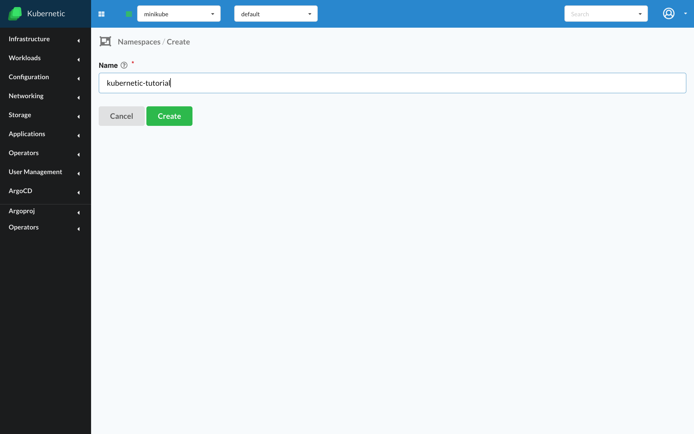
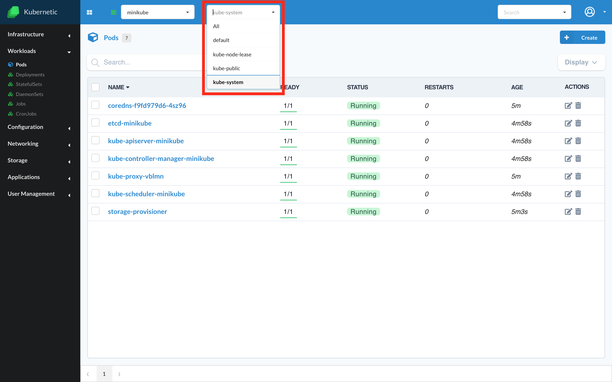

# Namespaces

Now that you have a working cluster connected to your _Kubernetic_ client you can continue with handling the namespaces.

::: tip
[Namespaces](https://kubernetes.io/docs/concepts/overview/working-with-objects/namespaces/) is a way to virtually split an existing cluster to separate environments. Most objects inside Kubernetes act inside a specific namespace, which means when you switch namespace a fresh environment will be provided.
:::

Go to screen **Settings** &gt; **Namespaces**

### List Namespaces

You will see there your existing namespaces. Kubernetes creates an active _"default"_ namespace automatically which is where your objects act on by default. It also creates a _"kube-system"_ namespace where all cluster's management objects are stored \(e.g. A DNS service\).

:::: tabs
::: tab with Kubernetic


:::
::: tab with Kubectl

```bash
> kubectl get namespaces
NAME              STATUS   AGE
default           Active   3m44s
kube-node-lease   Active   3m46s
kube-public       Active   3m46s
kube-system       Active   3m47s
```

:::
::::

### Creating Namespace

:::: tabs
::: tab with Kubernetic

Let's create a namespace:

* Fill name: **kubernetic-tutorial**
* Click **Create** button



:::

::: tab with Kubectl

```bash
kubectl create namespace kubernetic-tutorial
```

:::
::::

### Switching Namespace

:::: tabs

::: tab with Kubernetic

The active namespace can be seen on the top menu bar, you can switch to the new namespace by selecting the name. The current view will be refreshed to display the resources of the selected namespace.

You can also choose to display **All** namespaces. Table will be updated with a `Namespace` column to display the namespace of each resource.



:::

::: tab with Kubectl

e.g. to see the pods of `kubernetic-tutorial` namespace:

```bash
kubectl get pods --namespace kubernetic-tutorial
```

:::
::::

### Deleting Namespace

::: danger
Deletion of a namespace propagates the deletion of all resources under that namespace.
:::


:::: tabs
::: tab with Kubernetic

Namespaces can be deleted from the menu:


A confirmation dialog is shown before deleting the namespace:


:::
::: tab with Kubectl

To delete a namespace using kubectl CLI:

```bash
kubectl delete namespace kubernetic-tutorial
```

:::
::::

