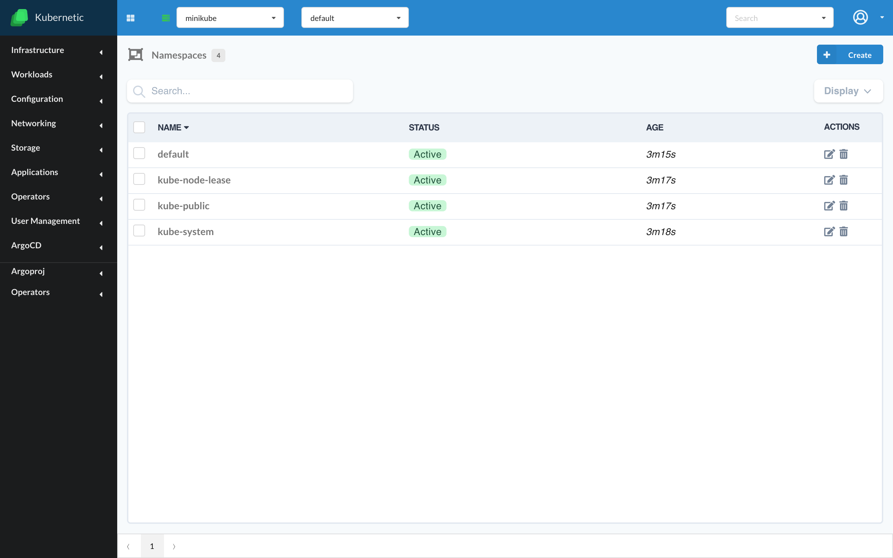

# Namespaces

Now that you have a working cluster connected to your _Kubernetic_ client you can continue with handling the namespaces.

?> [Namespaces](https://kubernetes.io/docs/concepts/overview/working-with-objects/namespaces/) is a way to virtually split an existing cluster to separate environments. Most objects inside Kubernetes act inside a specific namespace, which means when you switch namespace a fresh environment will be provided.

Go to screen **Settings** &gt; **Namespaces**

### List Namespaces

You will see there your existing namespaces. Kubernetes creates an active _"default"_ namespace automatically which is where your objects act on by default. It also creates a _"kube-system"_ namespace where all cluster's management objects are stored \(e.g. A DNS service\).



### Creating Namespace

**with Kubernetic**

Let's create a namespace:

* Fill name: **kubernetic-tutorial**
* Click **Add Namespace** button


**with Kubectl**

```bash
kubectl create namespace kubernetic-tutorial
```

### Switching Namespace

**with Kubernetic**

The active namespace can be seen on the top menu bar, you can switch to the new namespace by selecting the name:


**with Kubectl**

?> Namespace selection affects only Kubernetic. In order to see the selected namespace using kubectl you need to configure the command properly.

e.g. to see the pods of `kubernetic-tutorial` namespace:

```bash
kubectl get pods --namespace kubernetic-tutorial
```

### Deleting Namespace

**with Kubernetic**

Namespaces can be deleted from the menu:


A confirmation dialog is shown before deleting the namespace:


**with Kubectl**

To delete a namespace using kubectl CLI:

```bash
kubectl delete namespace kubernetic-tutorial
```

!> Deletion of a namespace propagates the deletion of all resources under that namespace.


