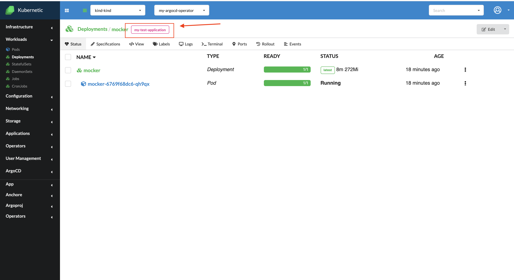

# ArgoCD

*Since version  v.2.11.0

Argo CD is a declarative, GitOps continuous delivery tool for Kubernetes. It follows the GitOps pattern of using Git repositories as a source for defining the desired application state. Argo CD automates the deployment of the desired application states in the specified target environments. Application deployments can track updates to branches, tags, or pinned to a specific version of manifests at a Git commit. For more details check out [ArgoCD official documentation](https://argoproj.github.io/argo-cd/)

**Setting up ArgoCD**

In order to set up ArgoCD to work with Kubernetic you, firstly, need to install the Operation Lifecycle Manager (OLM). See [Installing OLM](https://docs.kubernetic.com/features/settings/addons.html#installing-the-operator-lifecycle-manager-olm).

After you have the OLM installed, go to the "Available Operators" tab, select "argocd-operator" and press "Install"

You should have a namespace called **my-argocd-operator** automatically created during the operator installation and, in the side bar, the menu called **ArgoCD** should have appeared. 
Go to the ArgoCDs tab and create an ArgoCD instance. Optionally you can add customized specifications in the "spec" rubric. Note that you need to create this instance under the  **my-argocd-operator** namespace

After the installation you can check the Deployments tab and see if the following objects displayed in the image below were created. Note that this may take a few minutes

**Create an ArgoCD application**

After you have everything set up you can proceed creating an ArgoCD application. You can do that by going to the Applications tab, under the ArgoCD rubric. Press the button "Create" and complete the form if the data for your application

After your application have been created you can click on it and see all the objects that were created under it.

**Backlink**

In the workloads screens, if an object is created under a specific application it will have a backlink to emphasize that.

