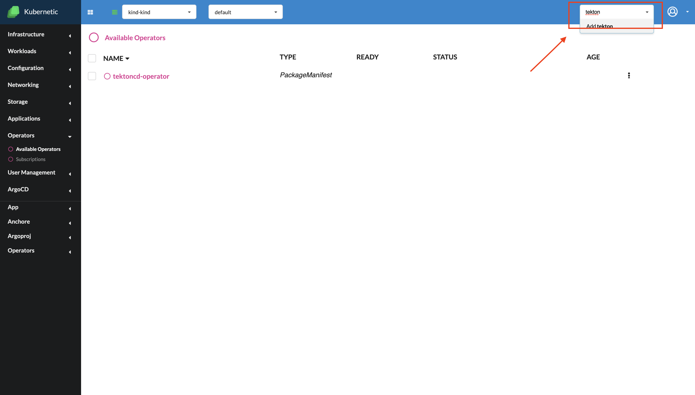
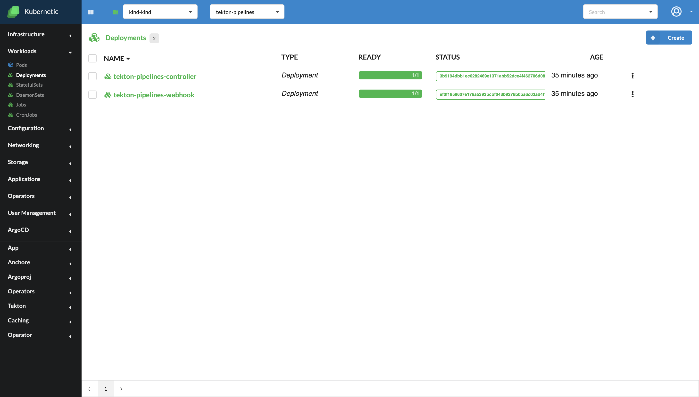
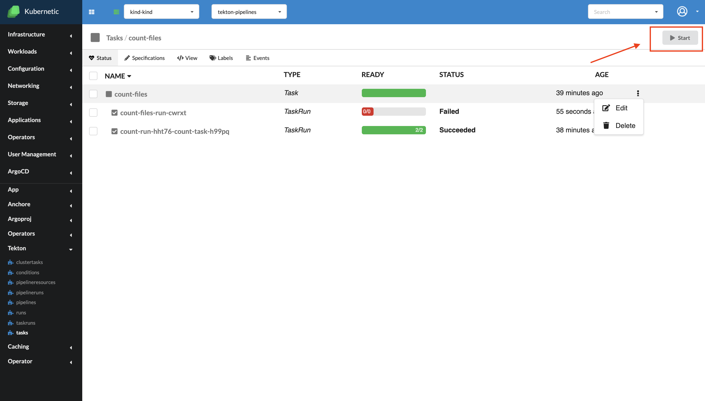
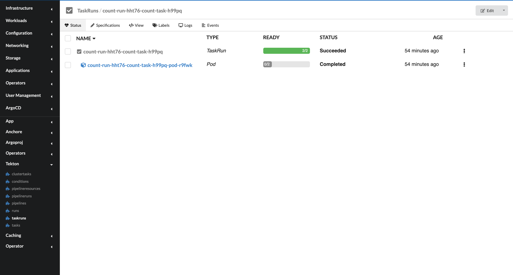
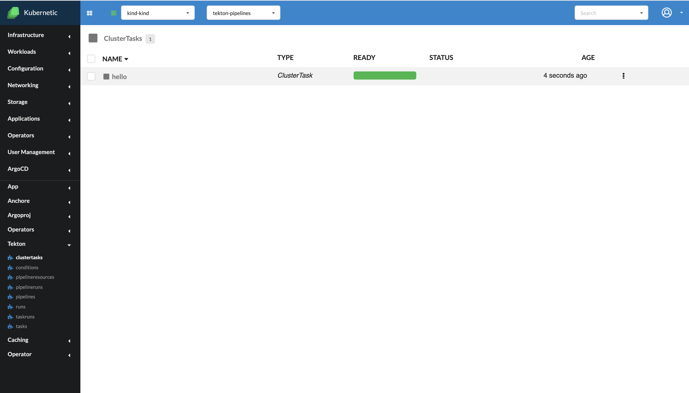
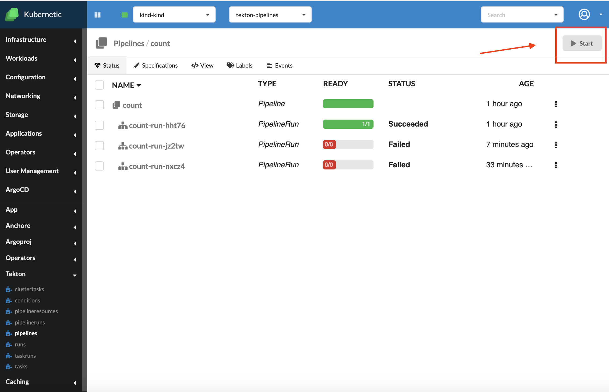
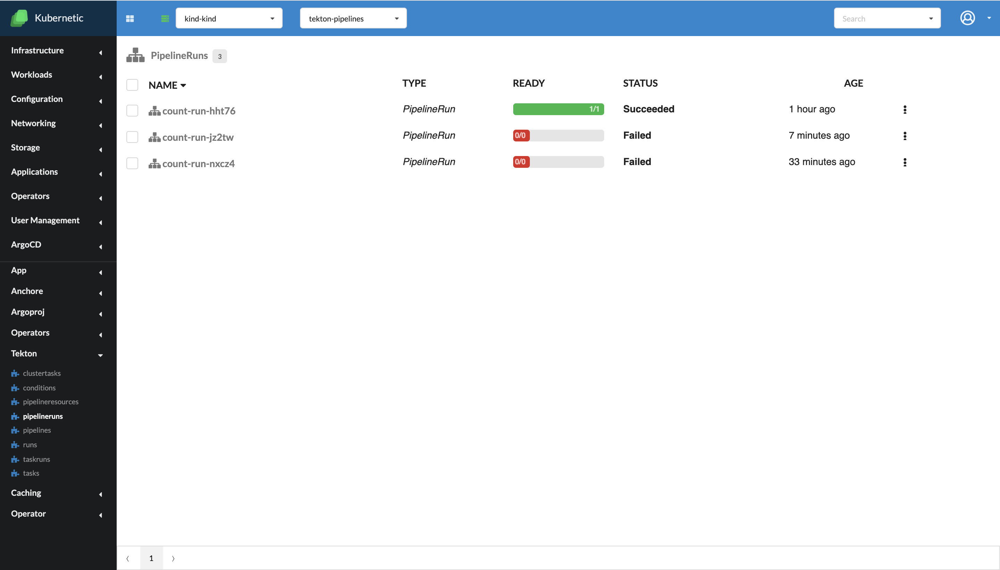
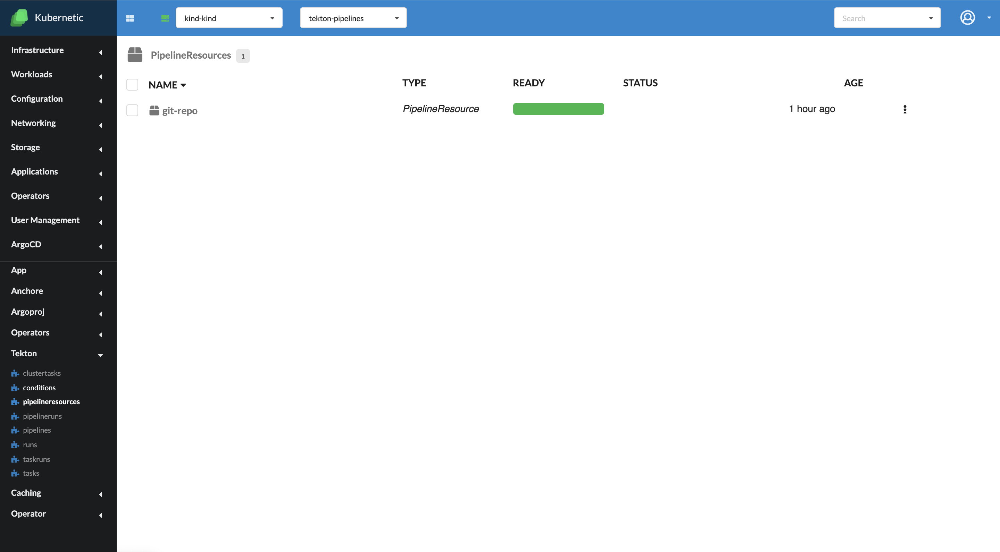
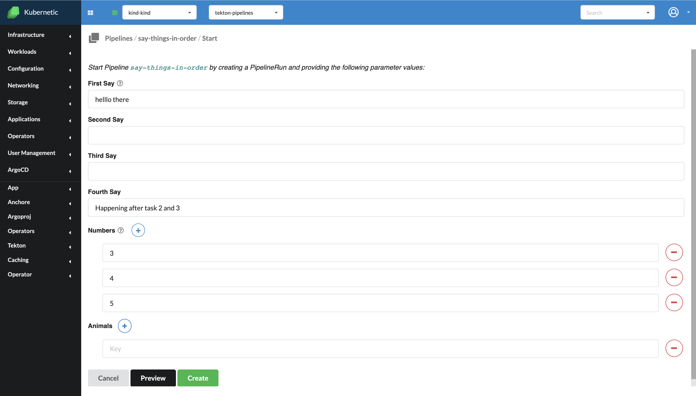

# Tekton 

*Since version  v.2.12.0

Tekton is a Kubernetes extension that installs and runs on your Kubernetes cluster. It defines a set of Kubernetes Custom Resources that act as building blocks from which you can assemble CI/CD pipelines. Once installed, Tekton Pipelines becomes available via the Kubernetes CLI (kubectl) and via API calls, just like pods and other resources. For more information about TektonCD features check out the [official documentation](https://github.com/tektoncd/pipeline/tree/master/docs).

**Setting up Tekton**

In order to set up TektonCD to work with Kubernetic you, firstly, need to install the Operation Lifecycle Manager (OLM). See [Installing OLM](https://docs.kubernetic.com/features/settings/addons.html#installing-the-operator-lifecycle-manager-olm).

After you have the OLM installed, go to the "Available Operators" tab, select "tekton-operator" and press "Install"

After the installation, we should have a new namespace called "tekton-pipelines" automatically created. In order to check if the installation was done successfully, you should find there two deployments : "tekton-pipelines-controller" and "tekton-pipelines-webhook"

If the installation was done correctly, in the side-bar it should appear a new category called "Tekton", encapsulating all the objects natives to this feature: Tasks, TaskRuns, Pipelines, PipelineRuns, ClusterTasks, PipelineResources and Conditions. 

**Tasks**

A Tetkton task defines a series of steps which launch specific build or delivery tools that ingest specific inputs and produce specific outputs. 

If you enter in the "tasks" subcategory you will be able to see a list of all the Tasks that are in the current namespace. The options available are to edit to delete Tasks. By clicking on a Task you will be able to see all the TaskRuns associated to that specific Task. In the top right part of the screen you should be able to see a "Start" button, that will create a TaskRun object to run your task. In the status part you can see if the process succeeded, or failed.

**TaskRuns**

A TaskRun instantiates a Task for execution with specific inputs, outputs, and execution parameters. Can be invoked on its own or as part of a Pipeline.

If you enter in the "taskruns" subcategory you will be able to see a list of all the TaskRuns that are in the current namespace. The options available are to edit to delete TaskRuns. If you click on a specific TaskRun you will be able to see its status, the pods associated with it and their status, as well.

**ClusterTasks**

A ClusterTask is the same as a normal Task, but it can work with resources at a cluster level. The functionalities of those two are the same from the Kubernetic app perspective.

**Pipelines**

Defines a series of Tasks that accomplish a specific build or delivery goal. Can be triggered by an event or invoked from a PipelineRun.

Pipelines  you will be able to see all the TaskRuns associated to that specific Task. In the top right part of the screen you should be able to see a "Start" button, that will create a PipelineRun object to run your pipeline. In the status part you can see if the process succeeded, or failed. 

**PipelineRuns**

A PipelineRun instantiates a Pipeline for execution with specific inputs, outputs, and execution parameters.

If you enter in the "pipelineruns" subcategory you will be able to see a list of all the PipelineRuns that are in the current namespace. The options available are to edit to delete them. If you click on a specific PipelineRun you will be able to see its status, the pods associated with it and their status, as well.

**PipelineResource**

Defines locations for inputs ingested and outputs produced by the steps in Tasks

If you enter in the "pipelineresources" subcategory you will be able to see a list of all the PipelineResources that are in the current namespace. The options available are to edit to delete them.

**Starting tasks and pipelines with parameters**

In case of more complex pipelines and tasks, there may be formulated several parameters in the object's definitions. In this situation, when pressing the "Start" button to run them, you will be asked to fill a form, mentioning the required parameters. 

