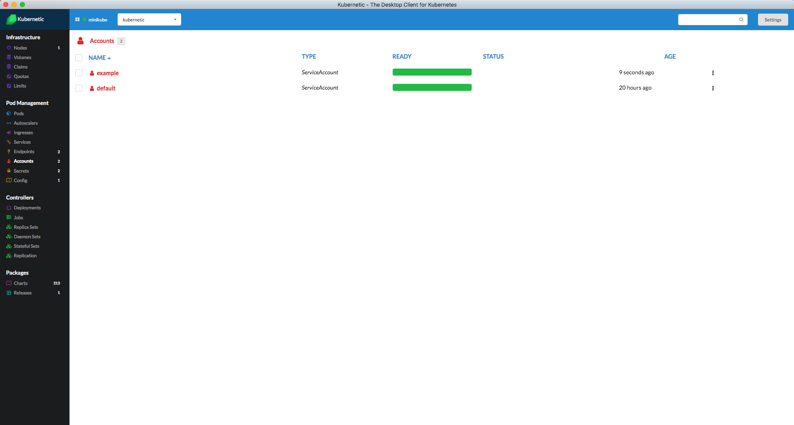

# ServiceAccounts

A service account provides an identity for processes that run in a Pod.

For more information about Service Accounts checkout the [Kubernetes User Guide](http://kubernetes.io/docs/user-guide/service-accounts/).

## Create a Service Account

Kubernetes will generate automatically a `default` Service Account on each Namespace.

Let's create an `example` Service Account: on kubernetic namespace:

```bash
kubectl create serviceaccount example --namespace kubernetic
```



### Cleanup

Delete the `example` Service Account:

```bash
kubectl delete serviceaccount example --namespace kubernetic
```


