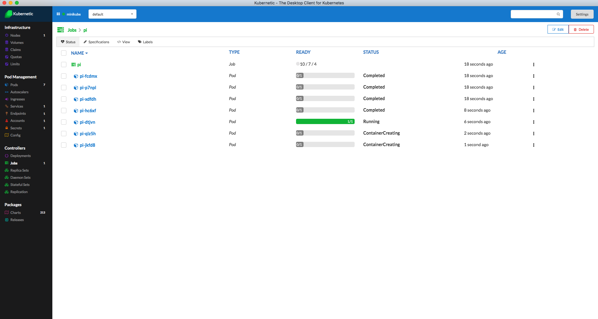

# Jobs

## Jobs

A job creates one or more pods and ensures that a specified number of them successfully terminate.

For more information about Jobs checkout the [Kubernetes User Guide](http://kubernetes.io/docs/user-guide/jobs/).

In this Tutorial you'll learn how to run a Job in the Cluster.

### Job Sample

In this scenario we want to run a batch job of 10 Pods that will calculate something \(in our case just sleep\), but keeping the maximum number of parallel executions to 3.

Go to the tutorial chart repo and run the `job-sample` chart.

Here is the Job definition:

```yaml
apiVersion: batch/v1
kind: Job
metadata:
  name: pi
spec:
  completions: 10
  parallelism: 3
  template:
    metadata:
      name: pi
    spec:
      containers:
      - name: pi
        image: alpine:3.4
        command: ["sleep",  "5"]
      restartPolicy: Never
```

Now go to the Jobs section. You'll see the `pi` Job that generates 10 Pods with a maximum of 3 in Running State at each moment.



Once desired number of successful Pods is reached then Job is marked green.

## Cleanup

You can now delete the Job.

