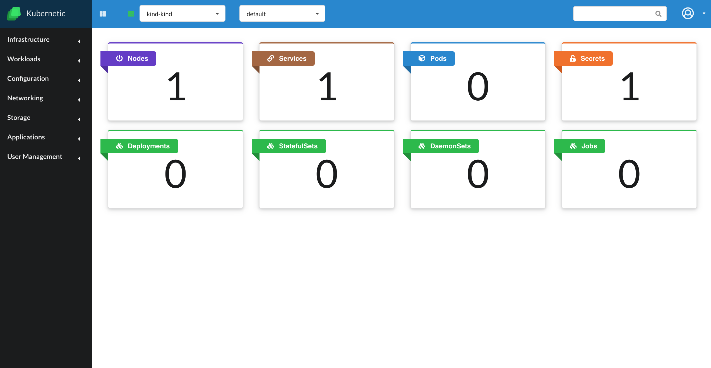

# Next Steps

Now that you have [installed Kubernetic] and have finished [setting up your cluster] you should be able to launch Kubernetic and see the Dashoard of your cluster:

[installed Kubernetic]: installation/
[setting up your cluster]: setup-cluster/

### Continue

* [Tutorials]: If you'd like to get to know the capabilities of Kubernetes you can go through our tutorials.

* [Features]: If you have previous experience on Kubernetes you can go ahead and shuffle through the features section to get to know better what you can do with Kubernetic.

[Features]: features/
[Tutorials]: tutorials/
