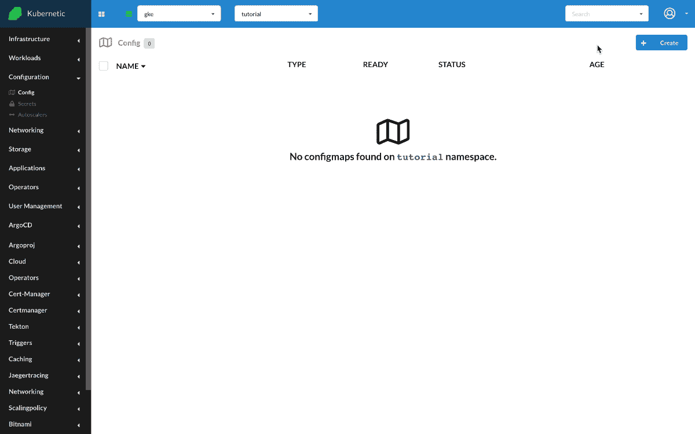
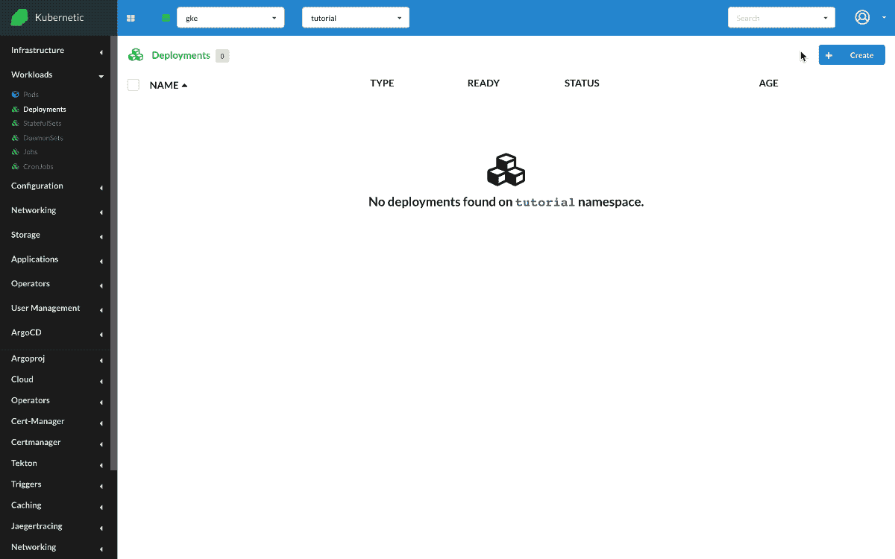

# ConfigMaps

?> During this tutorial you'll learn how to manage ConfigMaps on Kubernetes.

* Level: *beginner*
* Requirements: *none*
* Previous Tutorials: [deployments](/tutorials/workloads/deployments/)
* Can run on Cluster: *any*
* Can run on Namespace: *any*
* Images used: `nginx:alpine`

> [ConfigMaps](https://kubernetes.io/docs/concepts/configuration/configmap/) are TBD.

## Nginx with ConfigMap as Env Variables

We 'll be running an Nginx instance that we'll pass some environment variables, but instead of configuring the environment variables on the same workload (e.g. Deployment) we'll reference them from a ConfigMap.

First let's go and create a ConfigMap with some values.

* Create `ConfigMap`
  * Name: `nginx-config`
  * Data: [`COLOR:blue`, `DAY:monday`]



Now that we have created the ConfigMap, let's create the Nginx instance and configure two environment variables that take their value from the ConfigMap.

* Create `Deployment`
  * Name: `nginx`
  * Image: `nginx:alpine`
  * Env: [`COLOR:ConfigMap(nginx-config):COLOR`, `DAY:ConfigMap(nginx-config):DAY`]

Once created we can open a terminal and check the environment variables by running `env`. Their values should appear on screen

```sh
$ env
...
COLOR=blue
DAY=monday
```


## Nginx with ConfigMap as Volume

We can also use ConfigMaps as volumes. We'll re-use the previous ConfigMap and create a new deployment

* Create `Deployment`
  * Name: `nginx-volume`
  * Image: `nginx:alpine`
  * Volumes: [`/storage:ConfigMap(nginx-config)`]

Once created we can open a terminal and check the path `/storage`. It should contain two files `COLOR` and `DAY`, each one with the content of value.

```sh
~ # cd /storage/
/storage # ls
COLOR  DAY
/storage # tail *
==> COLOR <==
blue
==> DAY <==
monday
```



## Cleanup

Remember to delete the following resources after you finish this tutorial:

* on _active_ namespace:
  * `deployments/nginx`
  * `deployments/nginx-volume`