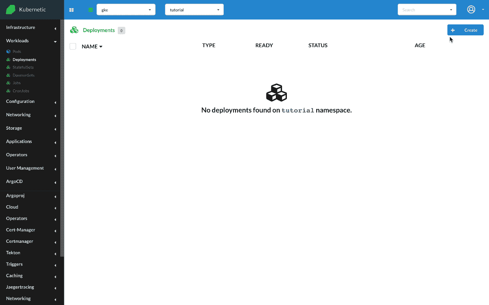

# Env. Variables

?> During this tutorial you'll learn how to manage environment variables on Kubernetes.

* Level: *beginner*
* Requirements: *none*
* Previous Tutorials: [deployments](/tutorials/workloads/deployments/)
* Can run on Cluster: *any*
* Can run on Namespace: *any*
* Images used: `jmalloc/echo-server:0.1.0`

> Environment variables is one of the ways to configure the workload instances.

## Echo Server

* Create: `Deployment`
  * Name: `echo-server`
  * Image: `jmalloc/echo-server:0.1.0`
  * Env: [`PORT:9999`]

We'll run a user image `jmalloc/echo-server:0.1.0` which listens to a configurable port and replies on requests. The code is located [here](https://github.com/jmalloc/echo-server#configuration) and the configuration sections tells us the following:

```markdown
Configuration

* The PORT environment variable sets the server port, which defaults to 8080
```

We'll deploy the image and configure a different `PORT` environment variable, e.g. `9999`. We check the logs and see the instance is listening to the configured port.



## Cleanup

Remember to delete the following resources after you finish this tutorial:

* on _active_ namespace:
  * `deployments/echo-server`