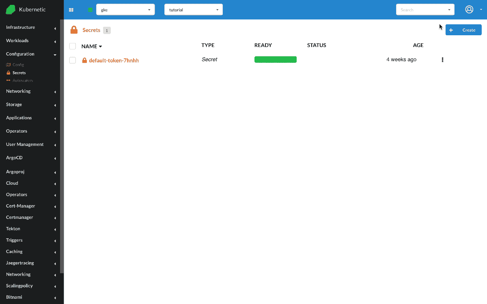
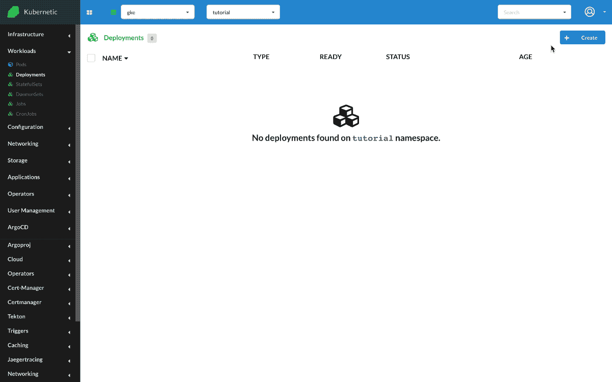

# Secrets

?> During this tutorial you'll learn how to manage Secrets on Kubernetes.

* Level: *beginner*
* Requirements: *none*
* Previous Tutorials: [deployments](/tutorials/workloads/deployments/)
* Can run on Cluster: *any*
* Can run on Namespace: *any*
* Images used: `nginx:alpine`

> [Secrets](https://kubernetes.io/docs/concepts/configuration/secret/) let you store and manage sensitive information, such as passwords, OAuth tokens, and ssh keys.

## Nginx with Secret as Env Variables

We 'll be running an Nginx instance that we'll pass some environment variables, but instead of configuring the environment variables on the same workload (e.g. Deployment) we'll reference them from a Secret.

First let's go and create a Secret with some values.

* Create `Secret`
  * Name: `nginx-secret`
  * Data: [`USERNAME:admin`, `PASSWORD:mypass`]



Now that we have created the Secret, let's create the Nginx instance and configure two environment variables that take their value from the Secret.

* Create `Deployment`
  * Name: `nginx`
  * Image: `nginx:alpine`
  * Env: [`COLOR:Secret(nginx-secret):COLOR`, `DAY:Secret(nginx-secret):DAY`]

Once created we can open a terminal and check the environment variables by running `env`. Their values should appear on screen

```sh
$ env
...
USERNAME=admin
PASSWORD=mypass
```


## Nginx with Secret as Volume

We can also use Secrets as volumes. We'll re-use the previous Secret and create a new deployment

* Create `Deployment`
  * Name: `nginx-volume`
  * Image: `nginx:alpine`
  * Volumes: [`/storage:Secret(nginx-secret)`]

Once created we can open a terminal and check the path `/storage`. It should contain two files `USERNAME` and `PASSWORD`, each one with the content of value.

```sh
~ # cd /storage/
/storage # ls
USERNAME  PASSWORD
/storage # cat USERNAME
admin
/storage # cat PASSWORD
mypass
```



## Cleanup

Remember to delete the following resources after you finish this tutorial:

* on _active_ namespace:
  * `deployments/nginx`
  * `deployments/nginx-volume`
  * `secrets/nginx-secret`