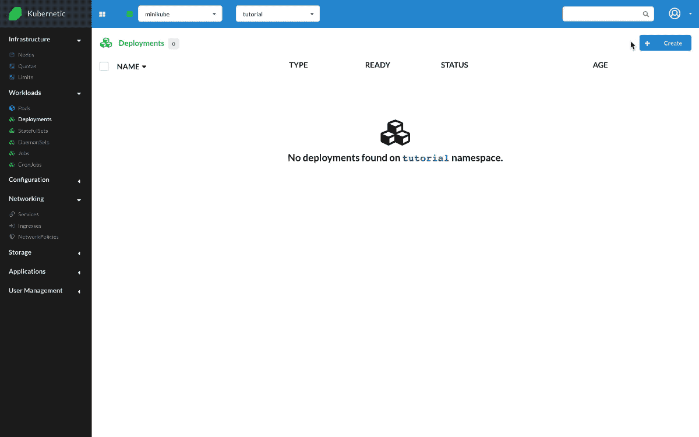
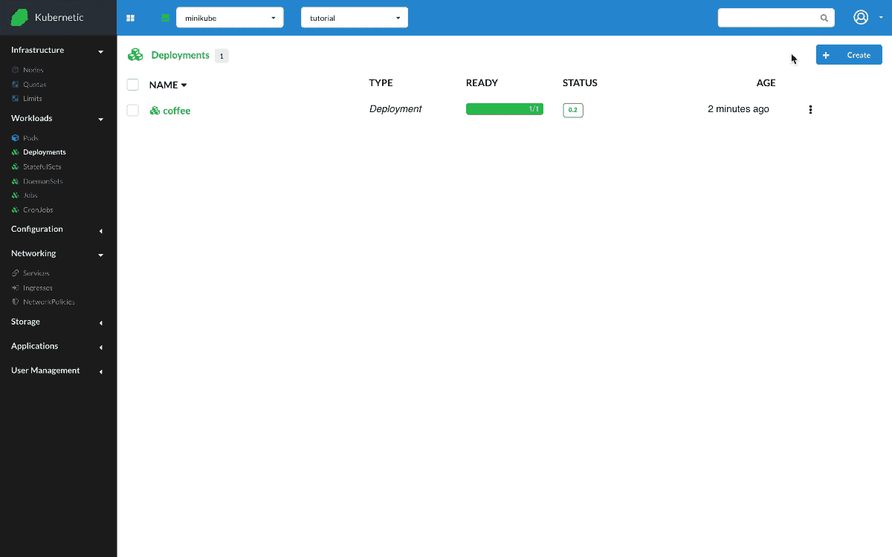
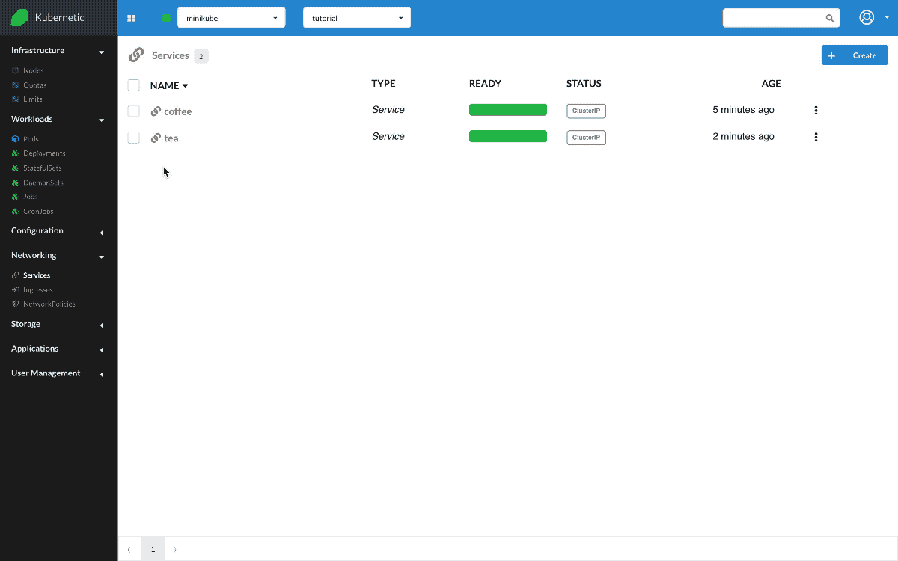

# Ingresses

?> During this tutorial you'll learn how to manage Ingresses on Kubernetes.

* Level: *beginner*
* Requirements: *none*
* Previous Tutorials: [deployments](/tutorials/workloads/deployments/), [services](/tutorials/workloads/services/)
* Can run on Cluster: *any*, [GKE](/setup-cluster/google-kubernetes-engine-gke)
* Can run on Namespace: *any*
* Images used: `nginxdemos/hello:0.2`

> [Ingresses](https://kubernetes.io/docs/concepts/services-networking/ingress/) manages external access to the services in a cluster, typically HTTP, they may provide load balancing, SSL termination and name-based virtual hosting.

## Setup Ingress Controller

!> For Ingresses to be functional in your cluster, you first need to have an Ingress Controller running. As a quick example to setup a cluster locally with Ingress Controller you can use [minikube](/setup-cluster/minikube):

```bash
# Start minikube
minikube start
# Enable ingress addon
minikube addons enable ingress
# annotate IP (In the example seen is "192.168.64.28")
minikube ip
```

## Simple fanout

A fanout configuration routes traffic from a single IP address to more than one Service, based on the HTTP URI being requested. An Ingress allows you to keep the number of load balancers down to a minimum. For example, a setup like:


```
192.168.64.28.xip.io -> 192.168.64.28 -> / coffee    coffee:80
                                         / tea       tea:80
```

First we'll create a deployment and service for `coffee`:

* Create `Deployment`
  * Name: `coffee`
  * Image: `nginxdemos/hello:0.2`
* Create `Service`
  * Name: `coffee`
  * Paths:
    * Port: `80`
    * Target Port: `80`



We'll also create a deployment and service for `tea`:

* Create `Deployment`
  * Name: `tea`
  * Image: `nginxdemos/hello:0.2`
* Create `Service`
  * Name: `tea`
  * Paths:
    * Port: `80`
    * Target Port: `80`



And then we'll create an Ingress rule that implements the above schema:

* Create `Ingress`
  * Name: `demo`
  * Host: `192.168.64.28.xip.io`
  * Paths: 
    * Path: `/coffee`, Service Name: `coffee`, Port: `80`
    * Path: `/tea`, Service Name: `tea`, Port: `80`

Once we create the Ingress, we can check the following URLs are functional:

* `192.168.64.28.xip.io/coffee`: We can check that one of the Pods of `coffee` deployment responds.
* `192.168.64.28.xip.io/tea`: We can check that one of the Pods of `tea` deployment responds.

