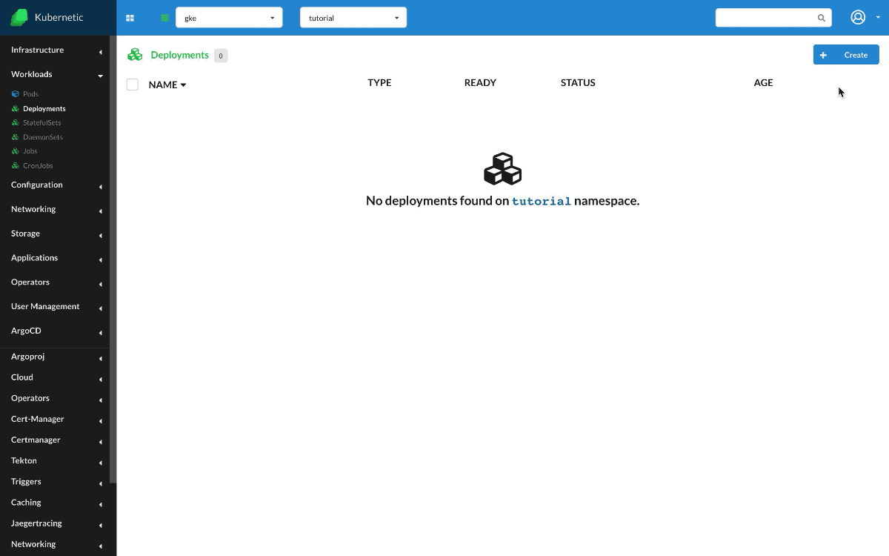
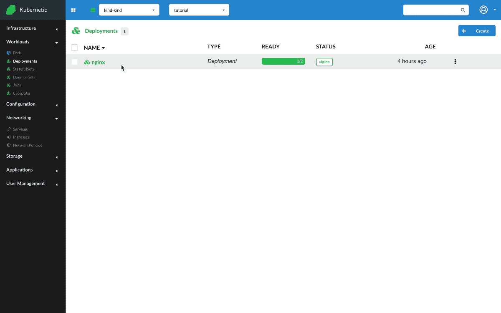
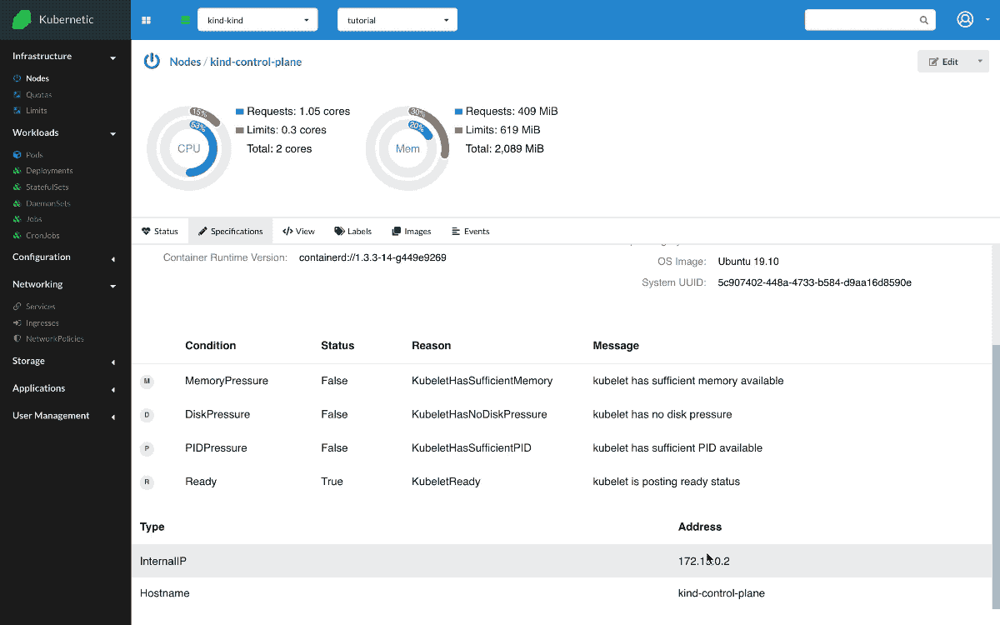

# Services

?> During this tutorial you'll learn how to manage Services on Kubernetes.

* Level: *beginner*
* Requirements: *none*
* Previous Tutorials: [deployments](/tutorials/workloads/deployments/)
* Can run on Cluster: *any*, [GKE](/setup-cluster/google-kubernetes-engine-gke)
* Can run on Namespace: *any*
* Images used: `nginx:alpine`

> [Services](https://kubernetes.io/docs/concepts/services-networking/service/) are an abstract way to expose an application running on a set of Pods as a network service.

## Nginx Deployment

* Create: `Deployment`
  * Name: `nginx`
  * Image: `nginx:alpine`

A Service connects a set of pre-existing Pods by using the `.spec.selector` field. Before creating a Service we need to already have running pods with the proper labels. In Kubernetic, same as with `kubectl create` commands, the label `app` is filled with the resource name as unique selector. So by creating a Deployment and Service with the same name they will share the same label selector and connect.

So, first create a Deployment with name `nginx` and image `nginx:alpine` which runs an [nginx](https://www.nginx.com/) web server, and scale up to two instances.

## Nginx ClusterIP Service

* Create: `Service`
  * Name: `nginx`
  * Type: `ClusterIP`
  * Paths:
    * Port: `80`
    * Target Port: `80`

Now that we have the deployment running, let's create a Service of `ClusterIP` type. `ClusterIP` service registers an IP on the services subnet and is balancing traffic between the selected set of Pods. Once the Service is up we can see on `Status` tab that two running Pods are connected to the Service. Let's open a `Terminal`, this will attach a shell in one of the running Pods. There we run two commands:

  * `curl localhost`: Since the command is run inside a running `nginx` Pod, the running nginx instance in the same Pod responds.
  * `curl nginx`: The Service is registered in the internal DNS, so when we try to contact `nginx` the DNS responds with the Service IP which balances the requests to all running Pods, any one of the two Pods responds.

We can also go to the `Ports` tab and start port-forwarding to a local port. We can click on the link to view the Service.

> `ClusterIP` service type is the most restrictive type of Service, as it is only accessible from within the Cluster.

## Nginx NodePort Service

* Create: `Service`
  * Name: `nginx`
  * Type: `NodePort`
  * Path:
    * Port: `80`
    * Target Port: `80`
    * Node Port: `30000`

Let's delete previous Service now and instead create a Service of type `NodePort`. `NodePort` service exposes a service to a unique node port, on all nodes of the cluster. Let's annotate first the IP of the node, then make sure we have `nginx` Deployment up and running, and finally create the `nginx` Service. Once created, we go to the `Terminal` and try the following command `curl <NODE-IP>:30000`, the request reaches the service through the node port.

> `NodePort` service type extends `ClusterIP` type by also sending traffic from the node port to the service Cluster IP.

## Nginx LoadBalancer Service

* Create: `Service`
  * Name: `nginx`
  * Type: `LoadBalancer`
  * Path:
    * Port: `80`
    * Target Port: `80`

!> In order to create a Service type `LoadBalancer` you need a Kubernetes provided by a cloud-provider, e.g. [GKE](/setup-cluster/google-kubernetes-engine-gke).

Let's delete previous Service now and instead create a Service of type `LoadBalancer`. `LoadBalancer` service exposes publicly the service by instructing an external LoadBalancer to redirect traffic to the Service. The Service will receive a public IP which can then be used to receive requests.

Once created, we go to the `Terminal` and try the following command `curl <EXTERNAL-IP>`, the request reaches the service through the external IP.

> `LoadBalancer` service type extends `NodePort` type by also instructing an external LoadBalancer to redirect traffic to the respective Service.

## Cleanup

Remember to delete the following resources after you finish this tutorial:

* on _active_ namespace:
  * `deployments/nginx`
  * `services/nginx`