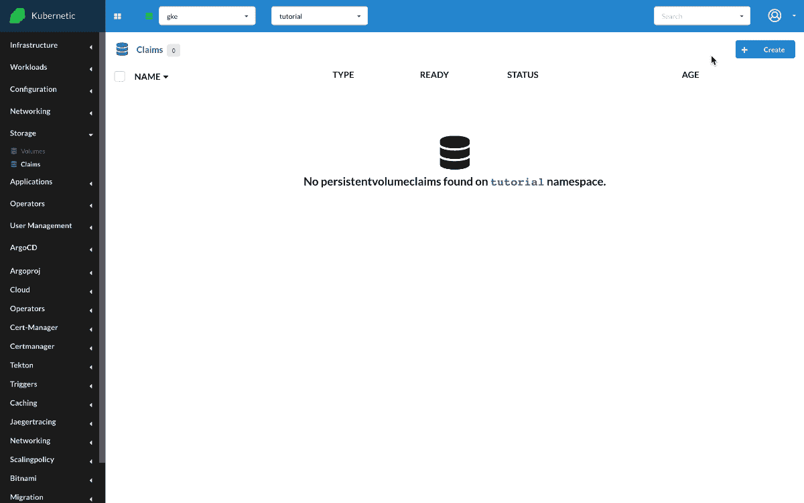
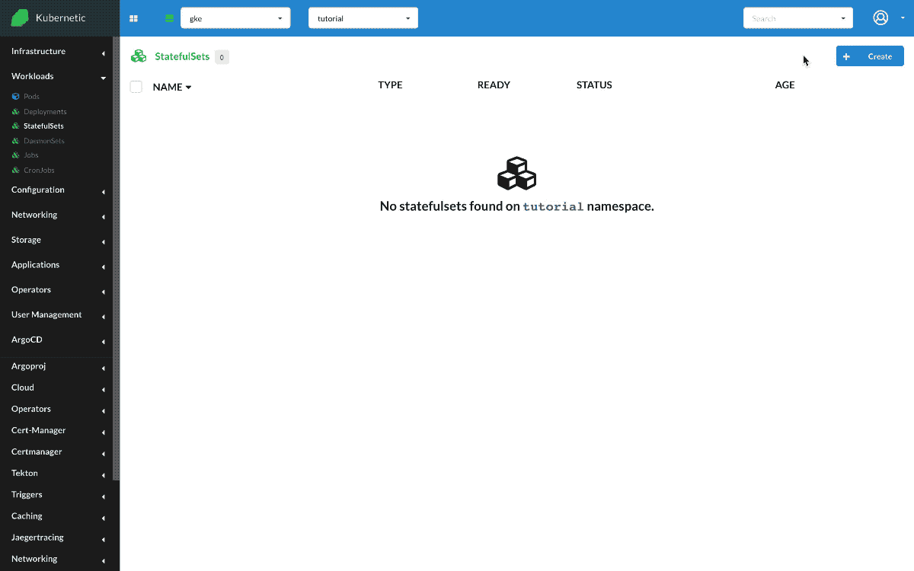

# Claims

?> During this tutorial you'll learn how to manage Claims on Kubernetes.

* Level: *beginner*
* Requirements: *default StorageClass*
* Previous Tutorials: [statefulsets](/tutorials/workloads/statefulsets/)
* Can run on Cluster: *any*
* Can run on Namespace: *any*
* Images used: `nginx:alpine`

> [PersistentVolumeClaim](https://v1-16.docs.kubernetes.io/docs/concepts/storage/persistent-volumes/#persistentvolumeclaims) is a request for storage by a user.

# Nginx with Persistent Volume Claim

We 'll be running an Nginx instance and we'll connect a Claim (PVC) for persistent data.

First let's go and create a Claim of `1Gi`. Once the Claim is created it will firstly appear as `Pending` until the request is processed by the [StorageClass](https://kubernetes.io/docs/concepts/storage/storage-classes/) provisioner.

* Create `PersistentVolumeClaim`
  * Name: `pvc-test`
  * Capacity Storage: `1Gi`



!> You need to have a default StorageClass configured in your cluster so that Claims can be provisioned.

Now that we have created the Claim and is bound properly, let's create the Nginx instance and mount the Claim. We use StatefulSet as they are more appropriate when persistent data are involved:

* Create `StatefulSet`
  * Name: `nginx-claim`
  * Image: `nginx:alpine`
  * Volumes: [`/storage:Claim(pvc-test)`]

Once created we can open a terminal and check the mounted volume is there, we create an `README.txt` file with some contents, restart the StatefulSet and check again to make sure the data are persistent across restarts.

```sh
/ # cd /storage/
/storage # ls
lost+found
/storage # echo Hello > README.txt
/storage # cat README.txt
Hello
```



## Cleanup

Remember to delete the following resources after you finish this tutorial:

* on _active_ namespace:
  * `claims/test`
  * `statefulsets/nginx-claim`