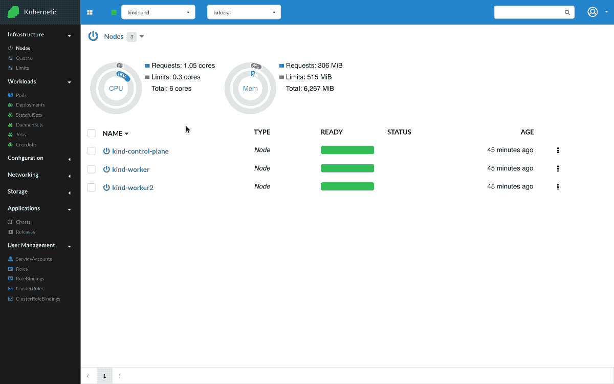

# Daemonsets

?> During this tutorial you'll learn how to manage Daemonsets on Kubernetes.

* Level: *beginner*
* Requirements: *none*
* Previous Tutorials: [pods](/tutorials/workloads/pods/)
* Can run on Cluster: *any* or [multi-node](/tutorials/clusters/multi-node)
* Can run on Namespace: *any*
* Images used: `quay.io/fluentd_elasticsearch/fluentd:v2.5.2`

> [DaemonSets](https://kubernetes.io/docs/concepts/workloads/controllers/daemonset/) ensures that all (or some) Nodes run a copy of a Pod. Typical use-case for is log collection or monitoring of the nodes of the cluster.
>
> You can run this example on any cluster, but for better visualization of the DaemonSets features you can setup a [multi-node](/tutorials/clusters/multi-node) cluster.

## Fluentd

* Create: `DaemonSet`
  * Name: `fluentd`
  * Image: `quay.io/fluentd_elasticsearch/fluentd:v2.5.2`

Let's run a [fluentd] instance on each node of our cluster. We run a multi-node cluster with 1 master and 2 workers. The daemonset by default is not running on the master unless you add a [toleration](https://kubernetes.io/docs/concepts/workloads/controllers/daemonset/#writing-a-daemonset-spec), so it will run on the two workers.

[fluentd]: https://www.fluentd.org/

## Cleanup

Remember to delete the following resources after you finish this tutorial:

* on _active_ namespace:
  * `daemonsets/fluentd`