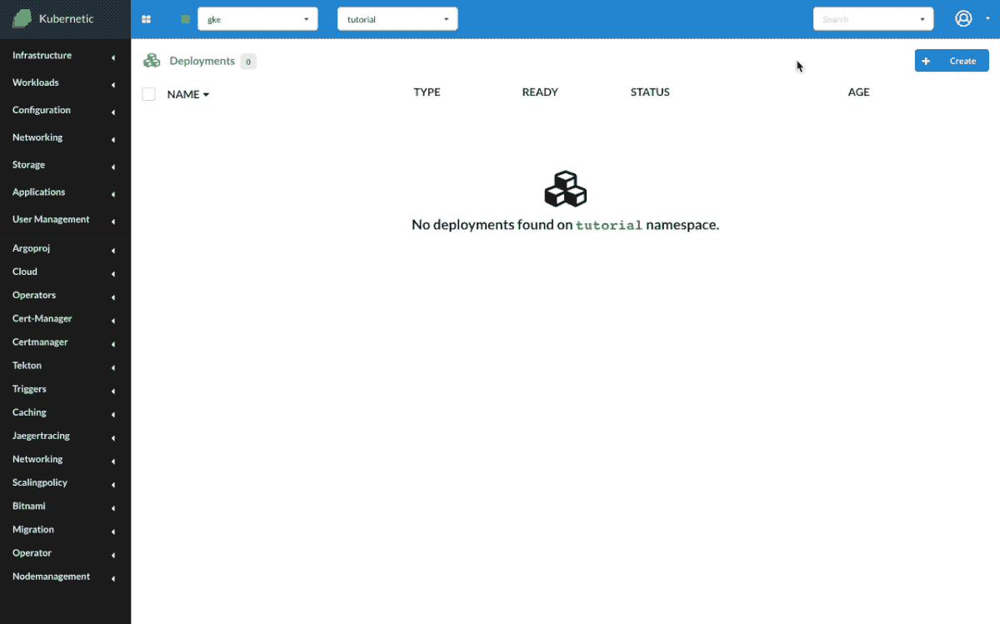
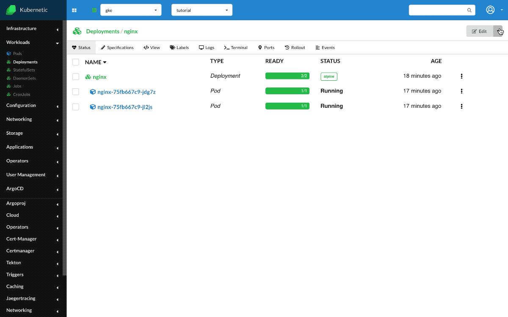
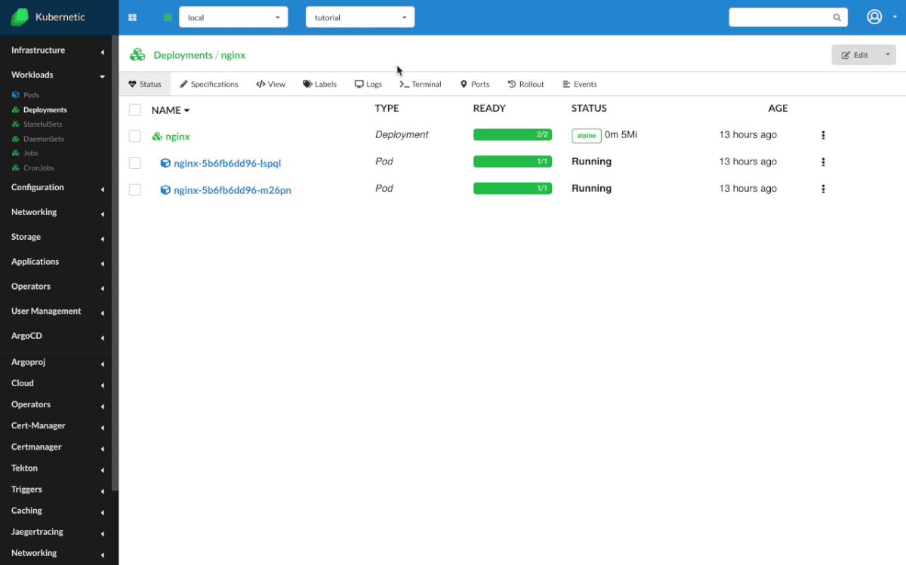

# Deployments

?> During this tutorial you'll learn how to manage Deployments on Kubernetes.

* Level: *beginner*
* Requirements: *none*
* Previous Tutorials: [pods](/tutorials/workloads/pods/)
* Can run on Cluster: *any*
* Can run on Namespace: *any*
* Images used: `nginx:alpine`, `nginx:1.19.2-alpine`

> [Deployments](https://kubernetes.io/docs/concepts/workloads/controllers/deployment/) ensure that a specified number of Pods are running and manage their update lifecycle.

## Nginx

* Create `Deployment`
  * Name: `nginx`
  * Image: `nginx:alpine`

Let's run a simple Deployment with image `nginx:alpine` which runs an [nginx](https://www.nginx.com/) web server. Once the Deployment is created it will manage one running Pod. We can scale up or down the deployment if we want to make sure more than one instances are running at one time. Let's scale it up to two instances. On the logs we can see the output of both Pods running nginx.

### Update Version

The image we used is `nginx:alpine`, which means is the `alpine` version of the `nginx` image. [Alpine] is a lightweight Linux distribution, a good fit as a base OS for the container images as it keeps the image size small. Another good practice though for production is to use specific versions instead of generic ones, so let's update the version of our image to `nginx:1.19.2-alpine` so that we make sure we control the exact version that we run.

When updating the deployment, the `spec.strategy` dictates how the pods will be replaced. By default a [Rolling update Deployment] strategy is chosen and updates the pods in a rolling update fashion, which is useful in order to achieve updates without downtime.

[Rolling Update Deployment]: https://kubernetes.io/docs/concepts/workloads/controllers/deployment/#rolling-update-deployment
[Alpine]: https://alpinelinux.org/about/

### Undo

Changes on the Deployment are registered as Revisions (A limit of number of revisions can be defined as `.spec.revisionHistoryLimit`). You can undo changes on a deployment by clicking `Undo` on a previous Revision under the `Rollout` tab.

### Restart

Let's perform now a restart without changing the deployment, click on the `Restart` button. This will enforce a rolling update (or the chosen `.spec.strategy` strategy) and will create fresh Pods for your Deployment.

## Cleanup

Remember to delete the following resources after you finish this tutorial:

* on _active_ namespace:
  * `deployments/nginx`