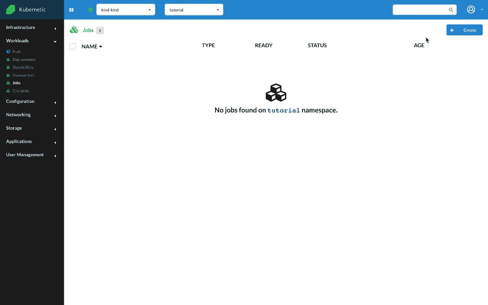

# Jobs

?> During this tutorial you'll learn how to manage Jobs on Kubernetes.

* Level: *beginner*
* Requirements: *none*
* Previous Tutorials: [pods](/tutorials/workloads/pods/)
* Can run on Cluster: *any*
* Can run on Namespace: *any*
* Images used: `hello-world`

> A [Job](https://kubernetes.io/docs/concepts/workloads/controllers/job/) creates one or more Pods and ensures that a specified number of them successfully terminate. As pods successfully complete, the Job tracks the successful completions. When a specified number of successful completions is reached, the task (ie, Job) is complete. Deleting a Job will clean up the Pods it created.

## Hello World

* Create `Job`
  * Name: `hello-world`
  * Image: `hello-world`

Let's run a simple Job with image `hello-world` which prints out a message on screen and exits.

## Cleanup

Remember to delete the following resources after you finish this tutorial:

* on _active_ namespace:
  * `jobs/hello-world`