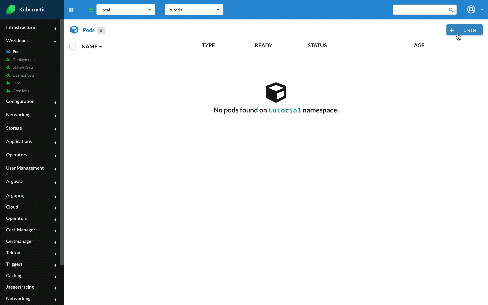
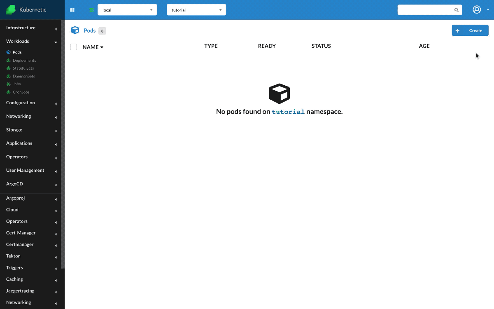

# Pods

::: tip
During this tutorial you'll learn how to manage Pods on Kubernetes.
:::

* Level: *beginner*
* Requirements: *none*
* Previous Tutorials: *none*
* Can run on Cluster: *any*
* Can run on Namespace: *any*
* Images used: `hello-world`,`jpetazzo/clock`

> [Pods](https://kubernetes.io/docs/concepts/workloads/pods/pod/) are the smallest deployable units of computing that can be created and managed in Kubernetes. A pod is composed by one or more containers. A container is a running instance of an image. Images are served by public or private registries.

## Hello world

* Create: `Pod`
  * Name: `hello-world`
  * Image: `hello-world`

Let's run a simple Pod with one container with image `hello-world`. This image is a simple example how to run a container that prints out a message on screen and exits.

Kubernetes by default is trying to keep Pods alive as it assumes they are long-lived processses, so when we create the Pod and it exits, it will be restarted automatically, but since it will keep exiting, Kubernetes in order to avoid unecessary CPU consumption it backoffs exponentially of restart tries (`CrashLoopBackOff` state).

On the Logs of the Pod you can see the output of the container.

Once you finish with the Pod you can safely delete it.

## Clock

* Name: `clock`
* Image: `jpetazzo/clock`

We've seen how to run a short-lived pod, now let's run a more normal use-case which is a long-lived pod. We'll use a user public image `jpetazzo/clock` which outputs the time every second on console.

In difference with previous example, this pod will stay alive (`Running` state).

## Cleanup

Remember to delete the following resources after you finish this tutorial:

* on _active_ namespace:
  * `pods/hello-world`
  * `pods/clock`