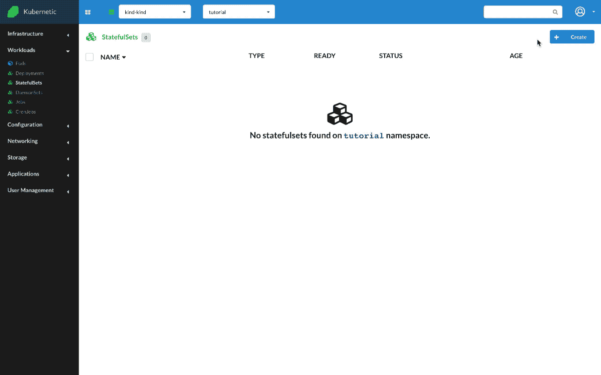
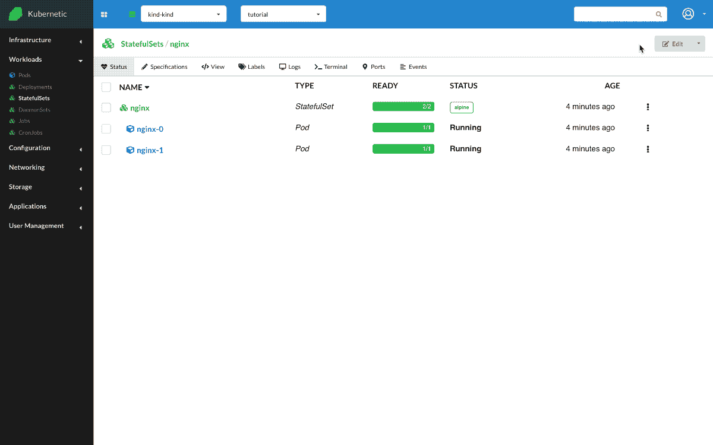

# StatefulSets

?> During this tutorial you'll learn how to manage StatefulSets on Kubernetes.

* Level: *beginner*
* Requirements: *none*
* Previous Tutorials: [pods](/tutorials/workloads/pods/)
* Can run on Cluster: *any*
* Can run on Namespace: *any*
* Images used: `nginx:alpine`, `nginx:1.19.2-alpine`

> [StatefulSets](https://kubernetes.io/docs/concepts/workloads/controllers/statefulset/) manages stateful applications.

## Nginx

* Create `StatefulSet`
  * Name: `nginx`
  * Image: `nginx:alpine`

Let's run a simple StatefulSet with image `nginx:alpine` which runs an [nginx](https://www.nginx.com/) web server. Once the StatefulSet is created it will manage one running Pod. We can scale up the StatefulSet to get more instances. Unlike Deployment, the Pods created have now fixed names (i.e. `nginx-0` and `nginx-1`) that ensure stable and unique network identifiers. When a Pod is down, a fresh pod with the same name will be recreated in it's place.

### Update Version

Let's update the image of the StatefulSet to `nginx:1.19.2-alpine`. This will trigger an ordered rolling update.

## Cleanup

Remember to delete the following resources after you finish this tutorial:

* on _active_ namespace:
  * `statefulsets/nginx`