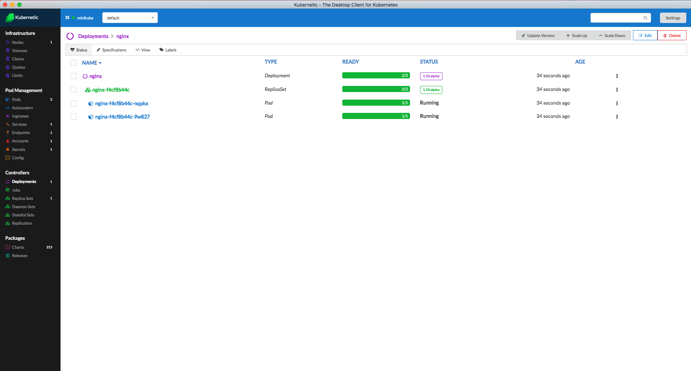
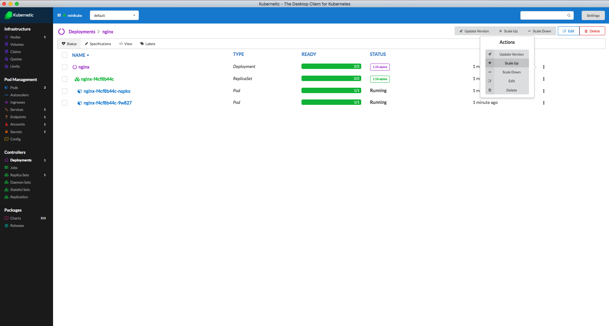
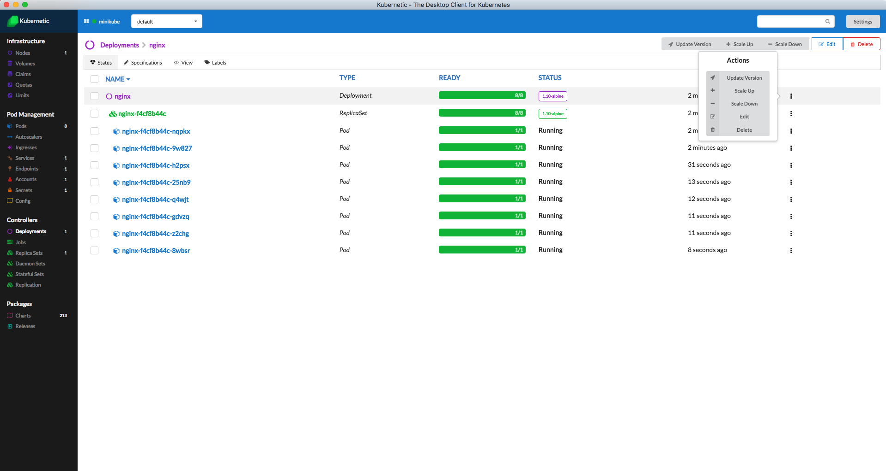
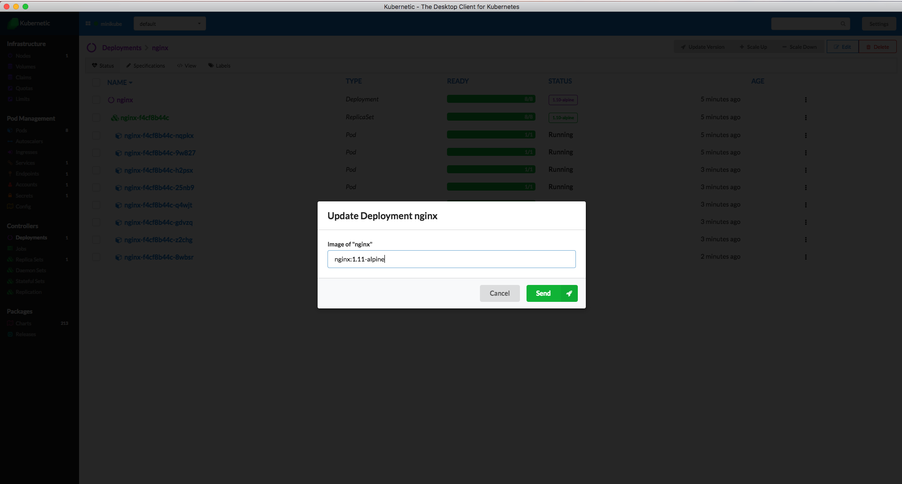
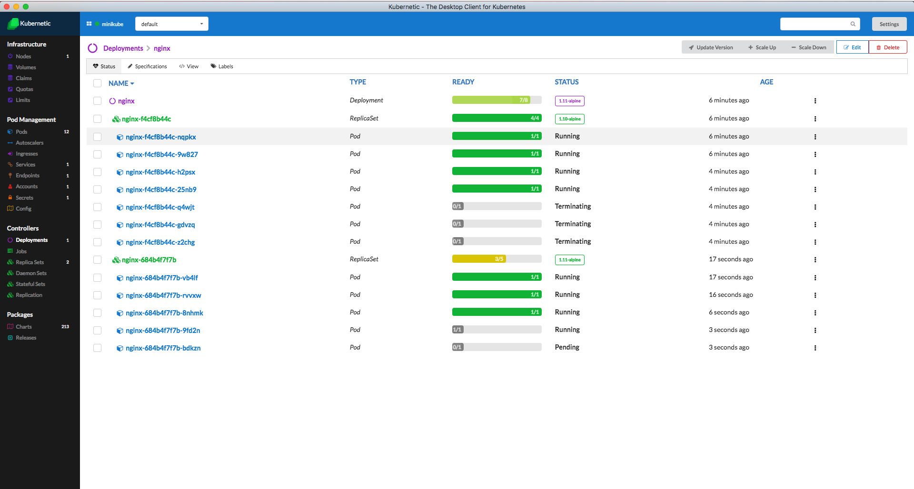
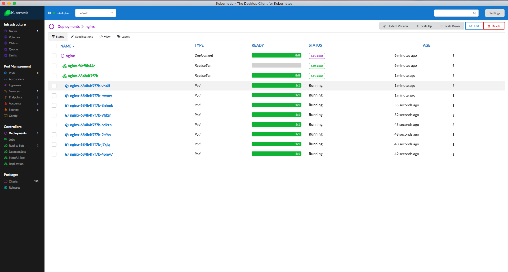

# Deployments

## Deployments

With Replica Sets we now have the definition multiple Pods under a specific version.

In order to be able to manage an upgrade or downgrade of a service without having downtime during the upgrade we have to handle multiple instances of both versions during the upgrade.

The objective of Deployment is to handle this process.

For more information about Deployments checkout the [Kubernetes User Guide](http://kubernetes.io/docs/user-guide/deployments/).

In this Tutorial you'll learn how to use Deployments efficiently to scale and upgrade your application without any downtime of your service.

### Deployment Nginx

Let's use a Deployment definition to deploy 2 Nginx instances in our Cluster.

Deploy [**kubernetic/deployment-nginx**](https://github.com/harbur/kubernetic-charts/tree/master/charts/deployment-nginx) Chart.

Here is the Deployment definition:



```yaml
apiVersion: extensions/v1beta1
kind: Deployment
metadata:
  name: nginx
spec:
  replicas: 2
  selector:
    matchLabels:
      app: nginx
  template:
    metadata:
      labels:
        app: nginx
    spec:
      containers:
      - name: nginx
        image: nginx:1.10-alpine
        ports:
        - containerPort: 80
        resources:
          requests:
            cpu: 100m
            memory: 100Mi

```



Now go to the Deployments section. You'll see the `nginx` deployment with the 2 Pods.



You'll see that the Deployment has generated a Replica Set and that in turn generated 2 Pods.

#### Scale Up

The Deployment is configured with 2 replicas, but we can update the definition of the Deployment to increase or decrease the number of Pods and that information is delegated to the Replica Set which in turn is responsible of the number of Pods running.

As an example use the buttons to the right of the Deployment in order to increase the number of Pods to 8.



The Pods are being generated and soon they are all in Running state.



#### Scale Down

Now decrease the number of Pods to 2 again.

The extra number of Pods are being terminated and removed from the cluster.

#### Upgrade Image

We currently use Nginx `1.10-alpine`, but there is a new version of Nginx `1.11-alpine` we want to deploy to the cluster.

Let's say we have 8 instances of Nginx running, the objective is to change all of them from `1.10-alpine` to `1.11-alpine` without loosing service availability.



Deployment will then generate a new Replica Set with the new image version and start increasing one by one the number of instances of the new version while decreasing the number of instances of the old version.



Finally the old Replica Set will be left with 0 instances and the new Replica Set with 8.



## Cleanup

Go to the Releases section and delete the release of the `deployment-nginx` Chart.

