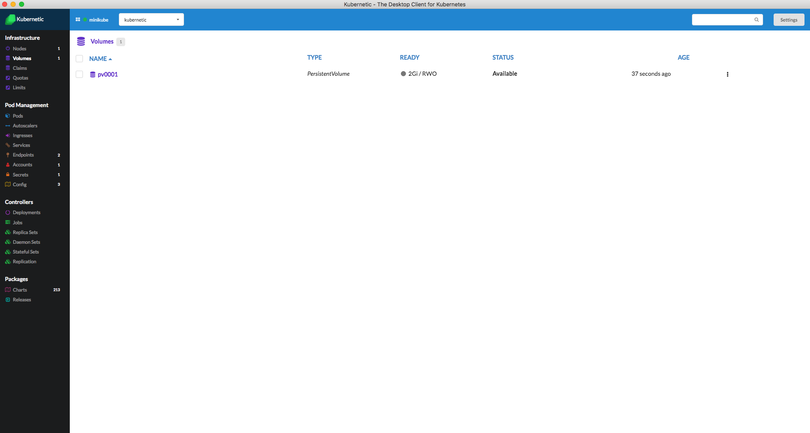
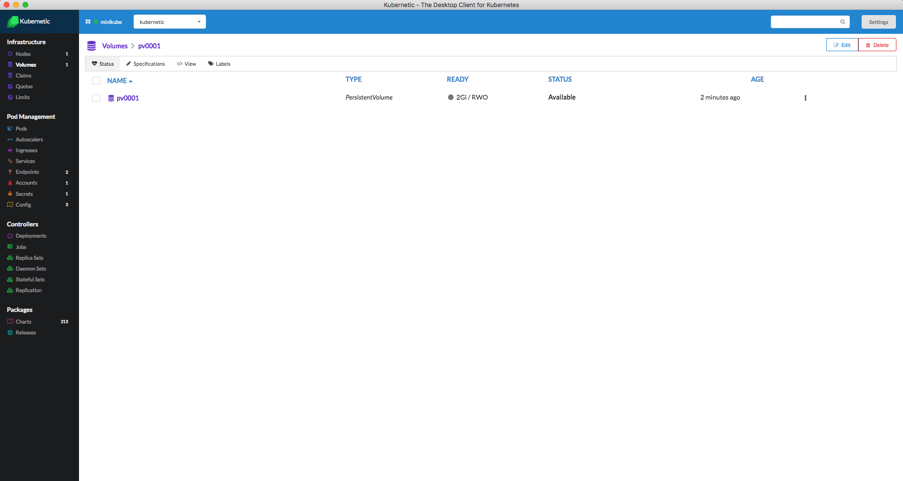

# Volumes


A [Persistent Volume](https://kubernetes.io/docs/concepts/storage/persistent-volumes/) \(PV\) is a piece of storage in the cluster that has been provisioned by an administrator.


Pods are ephemeral by design, in stateful applications we need the data of our instances to outlive the lives of the instances, so we need them to be stored outside of the containers.

Persistent Volumes define where Pods can claim Storage for their instances.

### Listing Volumes

The Persistent Volumes of the cluster are listed on the volumes section:

### Details of a Volume

Clicking on a Volume a detailed view of the Volume appears:

