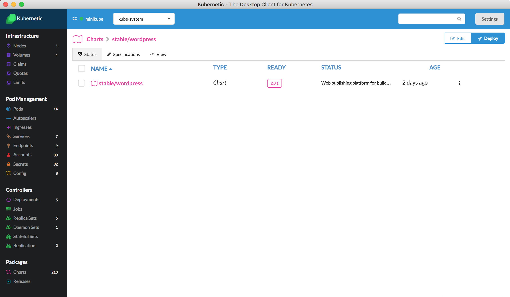

# Charts

In Charts section we manage the Helm Charts.

### Requirements

In order for Charts to be functional in Kubernetic, Helm's cluster component **Tiller** needs to be deployed on the cluster. Check [here](https://docs.helm.sh/using_helm/#installing-helm) for more details how to prepare the cluster.

Once helm's tiller is installed the following command should respond with client and server version

```bash
> helm version
Client: &version.Version{SemVer:"v2.9.0", GitCommit:"f6025bb9ee7daf9fee0026541c90a6f557a3e0bc", GitTreeState:"clean"}
Server: &version.Version{SemVer:"v2.9.0", GitCommit:"f6025bb9ee7daf9fee0026541c90a6f557a3e0bc", GitTreeState:"clean"}
```

### Listing Charts


### Details of a Chart

Clicking on a Chart a detailed view of the Chart appears:



### Deploying a Chart

Deploy of a chart installs the chart archive on a specific namespace.


The following options are configurable:

* **Release Name:** Release name. If unspecified, it will autogenerate one for you 
* **Namespace**: Namespace to install the release into. Defaults to the active namespace.
* **Values**: specify values in a YAML format. It is auto-populated with the default values of the Chart.

Once the Chart is deployed a Release is created.

