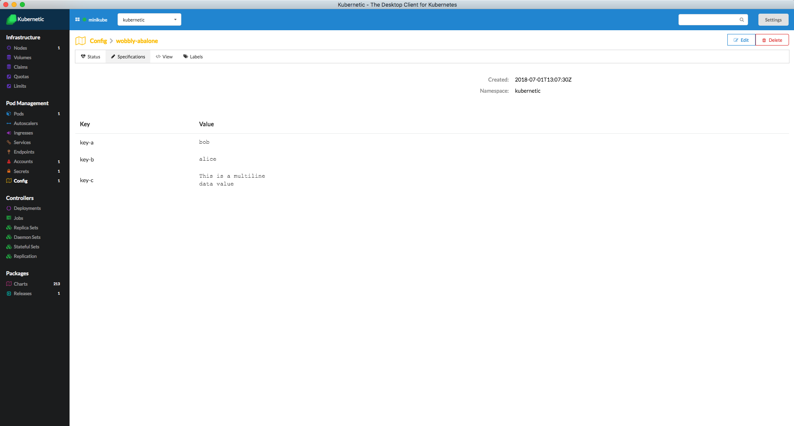

# Config

## Config Maps

The ConfigMap API resource holds key-value pairs of configuration data that can be consumed in pods or used to store configuration data for system components such as controllers.

For more information about Config Maps checkout the [Kubernetes User Guide](http://kubernetes.io/docs/user-guide/configmap/).

In this Tutorial you'll learn how to create a Config Map

### Config Map Sample

Deploy [**kubernetic/configmap-sample**](https://github.com/harbur/kubernetic-charts/tree/master/charts/configmap-sample) Chart.

Here is the Config Map definition:



```yaml
apiVersion: v1
kind: ConfigMap
metadata:
  name: {{ .Release.Name }}
data:
  key-a: bob
  key-b: alice
  key-c: |
    This is a multiline
    data value
```



```yaml
apiVersion: v1
kind: Pod
metadata:
  name: {{ .Release.Name }}-volume-mount
spec:
  restartPolicy: Never
  containers:
  - name: app
    image: "alpine:3.5"
    command: ["cat", "/config/app.conf"]
    volumeMounts:
    - mountPath: /config
      name: config
  volumes:
    - name: config
      configMap:
        name: {{ .Release.Name }}
        items:
        - key: key-c
          path: app.conf
```



Now go to the Config Maps section. You'll see the `configmap-sample` Config Map.



## Cleanup

Go to the Releases section and delete the release of the `configmap-sample` Chart.

