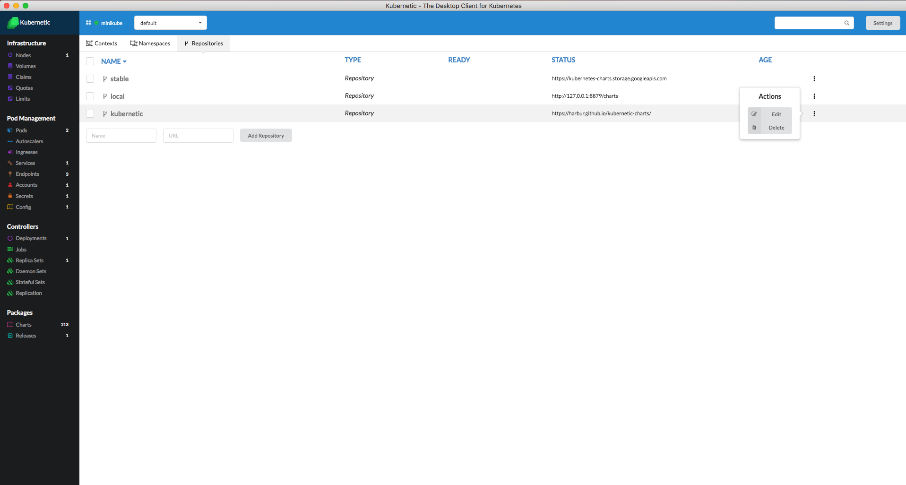

# Repositories

Kubernetic integrates with Helm as Package management. In this section the Repositories refer to Helm repositories.


In order for Repositories screen to be functional you need to install [helm](https://github.com/kubernetes/helm/releases) and do an init:

```bash
helm init --client-only
```


Go to screen **Settings** &gt; **Repositories**

### List Repositories

You will see the list of Repositories for Helm. By default helm configures **stable** and **local** repository.


### Adding Repository

Let's add a new repository:

* Fill name: **kubernetic**
* Fill URL: [https://harbur.github.io/kubernetic-charts/](https://harbur.github.io/kubernetic-charts/)
* Click **Add Repository** button


To add a repository using helm CLI:

```bash
helm repo add kubernetic https://harbur.github.io/kubernetic-charts/
```


### Deleting Repository

Repositories can be deleted from the menu:



A confirmation dialog is shown before deleting the repository:



To delete a repository using helm CLI:

```bash
helm repo remove kubernetic
```



